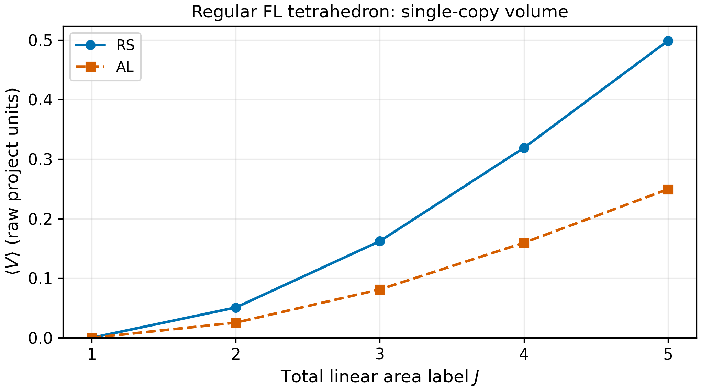
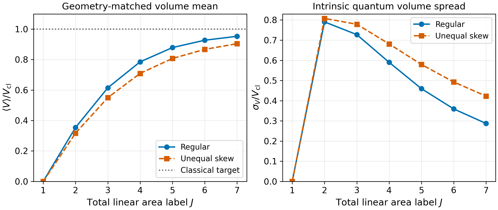
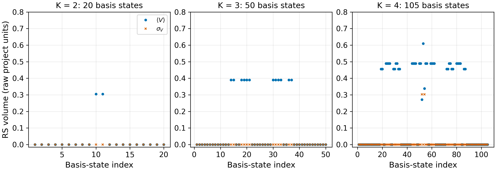
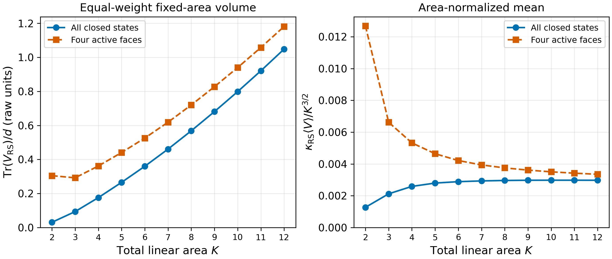
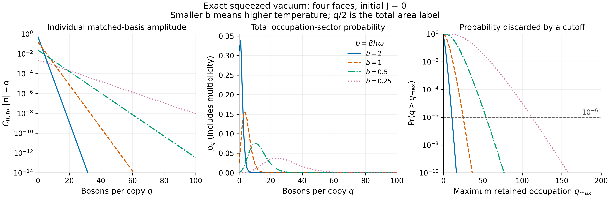
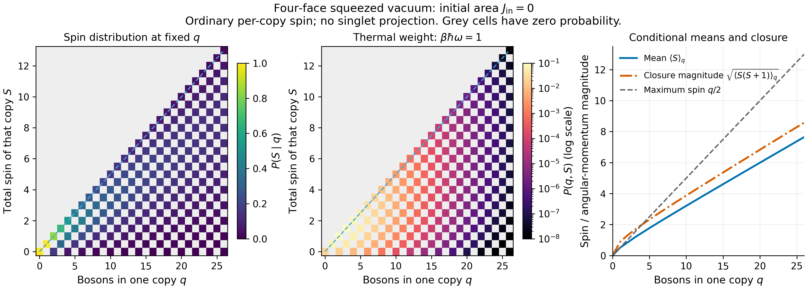
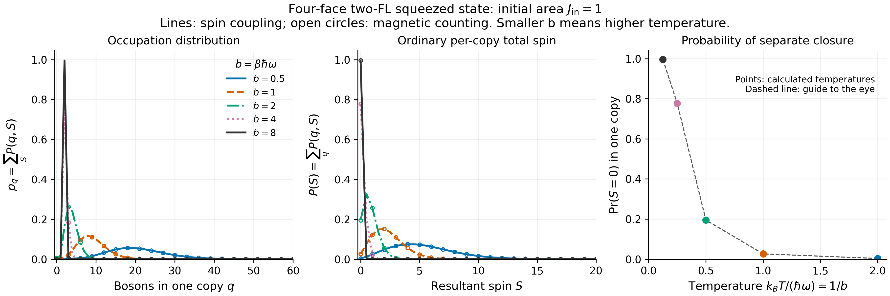
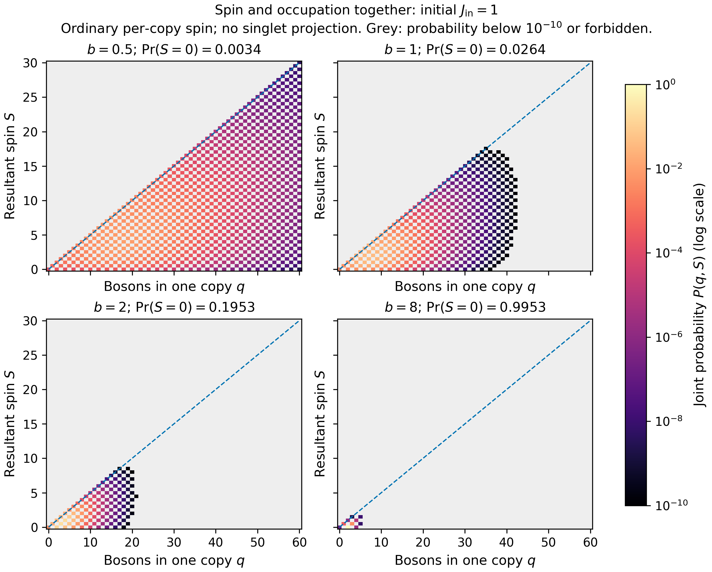

# Thermal intertwiners: area sectors, spin, and volume

Recorded 2026-10-08. This note connects the closed, single-copy Freidel–Livine (FL) volume studies with the selected two-copy squeezed construction, its occupation coefficients, and its reduced-state interpretation. The four-face $J_{\mathrm{in}}=1$ thermal occupation/spin distribution is calculated by two methods and independently checked in small sectors. Existing single-copy volume results provide the zero-temperature baseline; volume and entanglement calculations for the selected finite-temperature two-FL family remain open.

**Agent responsible for this consolidation and update:** GPT 6.1 Sol (2026-10-08).

This note consolidates the October 6 and October 8 physics discussions. The chronology at the end links their records. Analytic constructions, previously calculated examples, and remaining calculations are identified separately.

Read the single-copy preliminaries first if the oscillator notation is unfamiliar. They explain what area fixes, what shape can still change, and why the smallest four-face sector needs care. The thermal sections then show how squeezing distributes probability over occupation and spin sectors. The volume baseline and the later closure discussion together specify what a finite-temperature volume study would need to measure.

Further single-copy counting, lattice Hamiltonians, and Hamiltonian–volume commutators are recorded in the separate [volume-studies note](volume-studies.md). The existing thermal construction and volume baseline below are preserved.

## Contents

- [Motivation, earlier construction, and canonical TFD](#section-01)
- [Single-copy preliminaries: area, closure, and shape](#section-02)
  - [From boson occupations to face spins](#section-02-01)
  - [Allowed total areas and singlet support](#section-02-02)
  - [Fixed total area versus fixed face areas](#section-02-03)
  - [Why the four-face J = 2 case is special](#section-02-04)
- [Single-copy volume: theory and existing zero-temperature studies](#section-03)
  - [Positive volume, signed grasp, and fluctuations](#section-03-01)
  - [Classical comparison and fixed normalization](#section-03-02)
  - [Completed calculations and their limits](#section-03-03)
  - [Existing plots of volume versus area](#section-03-04)
  - [Complete closed-state volume calculation](#section-03-05)
- [State and occupation basis](#section-04)
- [Disentangling and sector coefficients](#section-05)
  - [Why the creation sum does not terminate](#section-05-01)
- [Density matrices and thermal averages](#section-06)
- [Geometric observables and closure](#section-07)
  - [How open copies can satisfy combined closure](#section-07-01)
  - [Opposite magnetic components and the right-copy convention](#section-07-02)
  - [From the zero-temperature baseline to thermal volume](#section-07-03)
- [Area, resultant spin, and magnetic number](#section-08)
- [Proposed nonzero-resultant-spin coherent family](#section-09)
- [Exact four-face vacuum illustration](#section-10)
  - [Physical interpretation of the vacuum input](#section-10-01)
- [Total spin as a function of boson number](#section-11)
- [Two methods for the four-face $J_{\mathrm{in}}=1$ distribution](#section-12)
  - [Reference input and coefficient matrix](#section-12-01)
  - [Method A: explicit spin coupling](#section-12-02)
  - [Method B: magnetic counting and a finite difference](#section-12-03)
  - [Comparison settings, independent checks, and results](#section-12-04)
  - [Plots of the $J_{\mathrm{in}}=1$ results](#section-12-05)
- [Scope and next calculations](#section-13)
- [Proposed further calculations](#section-14)
  - [1. Occupation and resultant-spin distributions](#section-14-01)
  - [2. Closure defects and their cancellation](#section-14-02)
  - [3. Reduced-state spectrum and entanglement](#section-14-03)
  - [4. Test for a fixed Gibbs Hamiltonian](#section-14-04)
  - [5. Ordinary and transformed geometric observables](#section-14-05)
  - [6. Separately closed alternatives](#section-14-06)
  - [Symmetry checks before expanding the numerical study](#section-14-07)
- [Chronology of the physics discussions](#section-15)

## Motivation, earlier construction, and canonical TFD

The draft doubles the Schwinger oscillators to represent thermal averages as pure-state expectations in a larger Hilbert space and to study coherent geometry with finite-temperature fluctuations. Its common face-temperature assumption was discussed in connection with gluing and equipartition. An interpretation of inter-copy entanglement as a wormhole remains a proposal.

The draft's one-sided construction is

$$
|J,\mathbf z\rangle_{\beta,L}
=U_\beta(|J,\mathbf z\rangle_L\otimes|0\rangle_R).
$$

The right copy is vacuum with respect to the transformed right annihilation operators, but generally contains excitations of the original oscillators. Our selected construction instead starts with an FL intertwiner in each copy, paired by complex conjugation.

Let $A_L$ and $\overline A_R$ create the normalized FL factors from their respective vacua, and define $\widetilde A=U_\beta A U_\beta^\dagger$. On the thermal vacuum $|0(\beta)\rangle=U_\beta|0,0\rangle$,

$$
\widetilde A_L\widetilde{\overline A}_R|0(\beta)\rangle
=U_\beta A_L\overline A_R|0,0\rangle.
$$

The adjacent unitary factors cancel. Acting with the same transformed creators on the ordinary doubled vacuum instead leaves $U_\beta A_L\overline A_R U_\beta^\dagger|0,0\rangle$, which is a different state.

For comparison, a canonical TFD of a specified Hamiltonian has the form

$$
|\mathrm{TFD}_\beta\rangle=Z^{-1/2}\sum_\alpha
 e^{-\beta E_\alpha/2}|E_\alpha\rangle_L\otimes|\overline{E_\alpha}\rangle_R.
$$

The states must form a complete orthonormal energy eigenbasis on the declared support. If that support is an intertwiner space, each copy satisfies its own gauge constraint. For four faces, an orthonormal recoupling basis couples faces 1 and 2 to an intermediate spin $k$, faces 3 and 4 to the same $k$, and the two intermediate spins to a singlet. FL coherent states are geometric superpositions, not an orthonormal energy basis. The selected squeezed FL family has not been shown to equal this canonical TFD.

The earlier literature discussion considered Kotecha–Oriti's volume/particle-number Gibbs ensemble and Assanioussi–Kotecha's doubled GFT thermal vacuum and coherent configurations. These were context, not prescriptions adopted for this project; the user's stated goal was to construct TFD states using intertwiners. The references recorded in that discussion are [arXiv:1801.09964](https://arxiv.org/abs/1801.09964) and [arXiv:1910.06889](https://arxiv.org/abs/1910.06889); this update does not independently reassess those papers.

## Single-copy preliminaries: area, closure, and shape

Before introducing temperature, consider one quantum polyhedron. Each face carries angular momentum, whose magnitude supplies its area label. A closed quantum state couples all these angular momenta to total spin zero. Fixing the sum of their magnitudes does not fix their individual values or the correlations that describe shape.

### From boson occupations to face spins

The Schwinger representation uses two oscillator modes on each face. Their total occupation gives the face spin; their difference gives its magnetic component:

$$
j_i=\frac{n_{a_i}+n_{b_i}}2,\qquad m_i=\frac{n_{a_i}-n_{b_i}}2,\qquad
J=\sum_i j_i=\frac{N_{\mathrm{bosons}}}{2}.
$$

For example, $(1,0)$ and $(0,1)$ are the two magnetic basis states of spin $1/2$. The occupation $(1,1)$ has spin $1$ and magnetic component zero. Putting $(1,1)$ on all four faces gives eight bosons and $J=4$, not $J=2$. A product of magnetic basis states is generally not closed; closure requires the appropriate superposition. See [Freidel–Livine, Eq. (6)](https://arxiv.org/html/1005.2090#S2.SS1).

### Allowed total areas and singlet support

Ordinary quantum closure is the constraint

$$
\mathbf G|\psi\rangle=0,\qquad \mathbf G=\sum_i\mathbf J_i.
$$

Although individual spins are half-integers, a singlet has integer total linear area:

$$
J=0,1,2,\ldots,\qquad
\mathcal H_N^{(J)}=\bigoplus_{\sum_i j_i=J}
\operatorname{Inv}\!\left(\bigotimes_i V^{j_i}\right).
$$

For specified spins, singlet support requires $\sum_i j_i$ to be an integer and $\max_i j_i\le\sum_{r\ne i}j_r$. For four faces, an explicit basis couples faces 1 and 2 to an intermediate spin $k$, faces 3 and 4 to the same $k$, and those two spins to zero. Allowed $k$ values belong to both pair-coupling ranges, with their required parity. The [repo enumerator](../code/python/fl_volume_labels.py) and [saved labels](../code/dashboard/fl-volume-allowed-labels.json) implement this counting. The space decomposition is given in [Freidel–Livine, Eqs. (1)–(3)](https://arxiv.org/html/1005.2090#S2).

If all $N$ faces have strictly positive spin, each contributes at least $1/2$, so $J\ge\lceil N/2\rceil$. Four active faces therefore require $J\ge2$. This condition concerns a definite face-spin assignment. An FL coherent state can have positive mean areas on every face while also containing components with zero-spin faces. Closure alone does not guarantee a nondegenerate polyhedron or nonzero volume: the closed space includes the vacuum and degenerate configurations.

The word area here means the linear FL label $J=\sum_i j_i$. The usual LQG area, proportional to $\sum_i\sqrt{j_i(j_i+1)}$, is a different operator. At fixed $J$, its value can vary between face-spin assignments. Volume-versus-area plots below use the linear label unless stated otherwise.

### Fixed total area versus fixed face areas

The single-copy FL state used by the repo is

$$
|J,\mathbf z\rangle\propto(F_z^\dagger)^J|0\rangle,\qquad
F_z^\dagger=\sum_{i<j}[z_j|z_i\rangle
(a_i^\dagger b_j^\dagger-a_j^\dagger b_i^\dagger).
$$

Each pair creator is an $SU(2)$ singlet, so the resulting state closes exactly and has $2J$ bosons. Its expansion generally mixes different face-spin assignments at that total occupation. The spinors determine their coherent amplitudes and the inter-face correlations, rather than prescribing one occupation vector.

For closed input normals $\mathbf n_i$ and area fractions $a_i>0$, with $\sum_i a_i=1$ and $\sum_i a_i\mathbf n_i=0$, choose $z_i=\sqrt{2a_i}\,\chi_i$, where the unit spinor $\chi_i$ has Bloch vector $\mathbf n_i$. Then

$$
\langle j_i\rangle=Ja_i.
$$

Unequal input areas are therefore unequal mean face spins, with fluctuations. Even equal means do not restrict the state to equal face-spin eigenvalues. Gauge invariance gives $\langle\mathbf J_i\rangle=0$; shape information is examined through correlations such as $\langle\mathbf J_i\cdot\mathbf J_j\rangle$. The classical vectors $Ja_i\mathbf n_i$ are input geometric labels, not those vanishing one-point means. See the [shared volume preliminaries](../memory-bank/implementation-details/volume-numerical-preliminaries.md) and [weighted-input study](../memory-bank/implementation-details/T5c-flux-covariance-volume-comparison.md).

### Why the four-face J = 2 case is special

At $J=2$, four bosons must be shared among the four faces. If every face spin is required to be nonzero and definite, the only assignment is $(1/2,1/2,1/2,1/2)$. It still has two singlet coupling channels, $k=0,1$. Allowing zero-spin faces produces 19 assignments and a total singlet-space dimension of 20, as recorded in the saved enumeration. Thus fixed total area does not select a unique state.

There is a further distinction between shape-dependent correlations and positive volume. In a real recoupling basis of the two-dimensional four-spin-$1/2$ singlet block, the signed triple-grasp matrix has the form

$$
Q=\begin{pmatrix}0&ic\\-ic&0\end{pmatrix},\qquad
|Q|=|c|I,\qquad \sqrt{|Q|}=\sqrt{|c|}I.
$$

Consequently the positive RS and AL volume operators, with the stated four-valent signs below, are each scalar on this block. Their expectations do not distinguish normalized superpositions within it, although other shape observables can. Every other allowed $J=2$ assignment has at most three active faces and zero volume on its singlet space. If $w_4$ is the FL state's probability in the four-active-face block, then

$$
\langle V_X\rangle=w_4 v_X,\qquad X\in\{\mathrm{RS},\mathrm{AL}\},
$$

where $v_X$ is the block's positive-volume eigenvalue. This is an analytic explanation of the small-area structure, not a new numerical scan. The variation in the repo's $J=2$ FL volume scan reflects changing block weights as the spinor labels change. It is not a spectrum of different positive-volume eigenvalues inside the fixed four-spin-$1/2$ block. At larger $J$, more active face-spin blocks and richer within-block spectra become available.

## Single-copy volume: theory and existing zero-temperature studies

The single-copy state above is the zero-temperature limit of either marginal of the selected two-FL family. Its area dependence is therefore the natural starting point for a thermal volume study. Volume is not fixed by total area alone: one must specify the state, its shape labels, and the operator prescription.

### Positive volume, signed grasp, and fluctuations

The triple grasp measures oriented flux correlations. To obtain positive volume, take the absolute value and square root of the operator before averaging:

$$
\hat q_{ijk}=\epsilon_{abc}J_i^aJ_j^bJ_k^c,
$$
$$
\hat V_{\mathrm{RS}}=c_{\mathrm{RS}}\sum_{i<j<k}\sqrt{|\hat q_{ijk}|},\qquad
\hat V_{\mathrm{AL}}=c_{\mathrm{AL}}\sqrt{\left|\sum_{i<j<k}\varepsilon_{ijk}\hat q_{ijk}\right|}.
$$

Here $i,j,k$ label faces; they are unrelated to the total area $J$. The $\varepsilon_{ijk}$ are graph-orientation signs. A signed mean $\langle\hat q\rangle$ may vanish while $\langle\sqrt{|\hat q|}\rangle$ is positive. Accordingly, the proxy $\sqrt{|\langle\hat q\rangle|}$ must not replace a positive volume expectation. The intrinsic spread is

$$
\sigma_V^2=\langle\hat V^2\rangle-\langle\hat V\rangle^2;
$$

it describes quantum fluctuations, not uncertainty in a sampled mean. The [Python operators](../code/python/positivity.py) and [volume-operator record](../memory-bank/implementation-details/volume-operator.md) specify the numerical conventions.

### Classical comparison and fixed normalization

At fixed input shape and area fractions, classical face vectors scale as $J$, so classical volume scales as $J^{3/2}$. For three tetrahedral face-area vectors meeting at a vertex,

$$
V_{\mathrm{cl}}=\sqrt{\frac29|\det(F_1,F_2,F_3)|}.
$$

The repo compares $\langle V\rangle/J^{3/2}$ with the unit-total-area classical target, and also reports quantum/classical ratios and normalized spreads. For its lexicographic AL signs $(+,-,+,-)$, the fixed geometric conversion factors multiplying the raw repository means are

$$
\kappa_{\mathrm{RS}}=\frac{\sqrt2}{12},\qquad
\kappa_{\mathrm{AL}}=\frac{\sqrt2}{6}.
$$

These factors follow from four-valent closure and are held fixed across shapes and areas. The geometry-matched RS and AL curves coincide on the tested singlet states because their triple operators obey the same signed closure relation. That coincidence is not independent validation. The outputs use $\gamma=0.2375$, $\hbar=1$, and repository prefactors; physical regularization constants and Planck-area conversion remain unresolved. Input classical geometry and a geometry inferred from quantum covariance are separate comparisons.

### Completed calculations and their limits

The following are existing single-copy studies under T1a/T5c, not newly completed thermal volume calculations under T9.

| Study | Saved coverage | Evidence and limits |
|---|---|---|
| Regular tetrahedron area sweep | Independently checked $J=1,\ldots,5$; weighted-input results through $J=7$; selected higher-$J$ points | [Validated sweep](../results/fl_volume_area_results.json), [driver](../code/python/fl_volume_validation.py). Positive volume vanishes at $J=1$ and grows in the tested range. |
| Shape dependence at fixed total area | 440 ordered equal-mean-area samples at $J=2$ | [Shape data](../code/dashboard/fl-volume-shape-j2.json). The regular tetrahedron is the sampled minimum, not a proven global minimum. The block-weight explanation above applies. |
| Weighted input geometries | Regular and unequal-skew tetrahedra at $J=1,\ldots,7$ | [Results](../results/t5c_input_geometry_results.json), [driver](../code/python/t5c_input_geometry_scan.py). Mean face spins and closure pass; volume means, variances, and correlations are saved. |
| Unequal-area shape grid | Nine shapes at $J=2,4$; four selected shapes at $J=6$ | [Grid](../results/t5c_weighted_shape_results.json), [selected higher-area points](../results/t5c_weighted_shape_j6_results.json). One area-fraction family, not broad shape coverage. |
| Flat and near-flat paths | Initial $J=2,4,6,7$ points, plus selected $J=8,9,10$ probes | [Initial results](../results/t5c_degenerate_limits_results.json), [higher-area results](../results/t5c_degenerate_limits_highJ_results.json). Finite-$J$ positive volume survives at zero input classical volume; neither order of the large-area and flat limits is established. |

For the two weighted starters, the geometry-matched mean divided by the corresponding classical volume is:

| $J$ | Regular | Unequal-skew |
|---:|---:|---:|
| 1 | 0 | 0 |
| 2 | 0.353553 | 0.316802 |
| 4 | 0.785167 | 0.709196 |
| 7 | 0.952866 | 0.904275 |

These finite-range results show approach toward the classical target for the tested shapes; they do not prove a general classical limit. At unequal areas, finite-$J$ flux correlations do not exactly recover the input normal angles. Dense positive-volume routines reject populated blocks above dimension 512 and use a shared numerical zero-eigenvalue cutoff. Independent checks support the regular sweep and small controls. At the $J=10$ flat point, Rust AL agrees with Python, while a roughly $4.4\times10^{-10}$ discrepancy in the geometry-matched Rust RS value remains unresolved. No $J=11$ flat result was produced by the stopped exploratory run.

### Existing plots of volume versus area

Plots and numerical coverage are distinct: later saved calculations are not all included in the current figures.

| Plot | Horizontal variable and content | Artifact |
|---|---|---|
| Regular tetrahedron positive volume | $J=1,\ldots,5$; raw RS and AL means in project units | [Standalone SVG](../code/dashboard/figures/fl-volume-area.svg) |
| Weighted-input mean comparison | $J=1,\ldots,7$; quantum/classical ratios for regular and unequal-skew inputs | Dashboard weighted-input section, generated by [plot source](../code/dashboard/t5c-input-volume.js) from [saved bundle](../code/dashboard/t5c-input-volume.json) |
| Weighted-input intrinsic spread | $J=1,\ldots,7$; $\sigma_V/V_{\mathrm{cl}}$ for the same inputs | Same dashboard source and bundle |
| Equal-mean-area shape scan | Shape coordinates at fixed $J=2$, rather than an area sweep | [Standalone SVG](../code/dashboard/figures/fl-volume-shape-j2.svg) |

The area graphs are displayed below. They replot the saved single-copy arrays; no state construction or volume calculation was rerun for these exports.

The first graph uses the independently checked $J=1,\ldots,5$ regular-tetrahedron sweep. The vertical axis is the raw positive-volume expectation in repository units, before geometric conversion. RS and AL use different raw normalizations. At $J=1$, closed components have too few active faces to carry tetrahedral volume; both positive means vanish. Connecting lines guide the eye between discrete integer areas. [Vector PDF](../figures/single-copy-volume/regular_volume_area.pdf); [backing arrays](../results/fl_volume_area_results.json).

The second figure compares regular and unequal-skew inputs at $J=1,\ldots,7$. Its left panel divides the geometry-matched mean by the classical volume of the same input face data at that $J$; the dotted line marks equality. Its right panel divides the intrinsic standard deviation by that classical volume. These spreads are quantum fluctuations, not errors on the calculated mean. Both mean and standard deviation use the fixed geometric factors above. Geometry-matched RS and AL coincide for these closed four-valent states, so one curve per shape suffices. The finite-range approach toward the classical target does not prove convergence for arbitrary shapes. [Vector PDF](../figures/single-copy-volume/weighted_volume_area.pdf); [backing arrays](../results/t5c_input_geometry_results.json).

The [reproducible plotting source](../code/python/plot_single_copy_volume.py) exports vector PDFs and 300-DPI PNGs. The [plot summary](../figures/single-copy-volume/plot_summary.json) records source hashes, display coverage, and array checks. The exports and these captions were added by **GPT 6.1 Sol** on 2026-10-08.

The dashboard also contains unequal-area grids at selected $J$ and categorical comparisons along a flat path. Those are not continuous volume-versus-area curves. The selected higher-$J$ probes are not included in the two figures above.

### Complete closed-state volume calculation

The subsequent discussion adopts $K$ for total linear area and $J$ for resultant angular momentum. In this subsection, $K$ corresponds to the area label called $J$ in the earlier sections, and closure means resultant $J=0$. Historical thermal formulas and saved FL files above retain their original notation.

A complete recoupling basis has now been enumerated and its positive volume matrices calculated for four labelled faces at $K=2,\ldots,12$: 10,549 basis states in total, including 20, 50, and 105 states at $K=2,3,4$. This is a different study from selecting one FL coherent state at each area. The basis labels specify face spins and intermediate pair spin; arbitrary closed states are superpositions of these basis vectors.

The points show individual-state RS means and intrinsic spreads in raw project units, indexed in the saved enumeration order. At $K=2$, two states have positive mean volume and the remaining 18 have zero volume; both positive-volume states have zero spread. These basis states need not be volume eigenstates at larger area. AL has half the raw RS value for the stated four-valent signs.

These curves average all orthonormal states at fixed area with equal weights. The blue curve includes zero-spin faces; the orange curve conditions on all four faces being active. The right panel includes the fixed geometric conversion and divides by $K^{3/2}$. There is no fixed input shape or single classical target for these ensembles. They are neither the earlier FL shape curves nor canonical-temperature results.

Every basis state's mean, second moment, and spread are saved in CSV. Complete scalar-product, triple-grasp, and RS/AL volume blocks, squares, and eigensystems are stored losslessly in packed compressed NPZ archives, with basis transformations in CSR form. The largest singlet block at $K=12$ is only $7\times7$; the complete archive for that area is about 2.5 MB. An extension to $K=13$ was stopped at the user's request before archive verification finished, and is not included.

All completed areas pass singlet and matrix checks and an independent sparse local-spin triple-grasp comparison. Through $K=4$, further dense tensor-product, oscillator, and magnetic-space spectral-root comparisons pass. The largest recorded residual is below $8\times10^{-14}$ against a declared $2\times10^{-10}$ tolerance. Physical normalization and finite-temperature volume remain open. See the [calculation and storage guide](../results/closed-basis-volume/README.md), [summary](../results/closed-basis-volume/summary.json), and [calculation source](../code/python/closed_basis_volume.py). The plots export vector PDFs and 300-DPI PNGs from the saved results.

With these single-copy baselines established, the next sections introduce the two-copy state and its occupation expansion. The later closure discussion explains why simply applying the same ordinary volume operator at finite temperature does not automatically describe two separately closed polyhedra.

## State and occupation basis

We now return to two copies. Each starts as a closed FL state at the same initial area. Squeezing preserves equal total occupations between the copies, but spreads that common occupation over infinitely many final sectors. An occupation basis makes both this redistribution and the partial trace explicit.

The construction selected for T9 is

$$
|\Psi_\beta\rangle = U_\beta |\Psi_0\rangle,\qquad
|\Psi_0\rangle = |J,\mathbf z\rangle_L\otimes|\overline{J,\mathbf z}\rangle_R.
$$

Each fixed-$J$ FL intertwiner has $2J$ Schwinger bosons in each copy. At fixed $J$ and number of faces $N$, it is a vector in a finite-dimensional fixed-total-number subspace. The oscillator Fock space containing all occupations remains infinite-dimensional.

Write an orthonormal occupation basis for one copy as

$$
|\mathbf n\rangle_X = |n_1^a,n_1^b;\ldots;n_N^a,n_N^b\rangle_X
= \prod_{i=1}^N\frac{(a_{iX}^\dagger)^{n_i^a}(b_{iX}^\dagger)^{n_i^b}}{\sqrt{n_i^a!n_i^b!}}|0\rangle_X,\qquad X=L,R.
$$

An individual doubled basis vector is $|\mathbf n,\mathbf m\rangle=|\mathbf n\rangle_L\otimes|\mathbf m\rangle_R$. The initial product has a finite expansion,

$$
|\Psi_0\rangle=\sum_{\mathbf n,\mathbf m}f_{\mathbf n}(\mathbf z)\overline{f_{\mathbf m}(\mathbf z)}|\mathbf n,\mathbf m\rangle,
\qquad |\mathbf n|=|\mathbf m|=2J,
$$

where $|\mathbf n|=\sum_i(n_i^a+n_i^b)$. A generic occupation vector need not itself satisfy closure; an intertwiner is the appropriate closed superposition.

The two-copy squeeze is generated by

$$
K_+=\sum_{i=1}^N(a_{iL}^\dagger a_{iR}^\dagger+b_{iL}^\dagger b_{iR}^\dagger),\qquad K_-=K_+^\dagger,
$$
$$
K_0=\frac12(N_L+N_R+2N),\qquad
N_X=\sum_i(a_{iX}^\dagger a_{iX}+b_{iX}^\dagger b_{iX}).
$$

They obey $[K_0,K_\pm]=\pm K_\pm$ and $[K_+,K_-]=-2K_0$. The squeeze is

$$
U_\beta=e^{\theta(K_+-K_-)},\qquad \tanh\theta=t=e^{-\beta\hbar\omega/2}.
$$

For example, an individual pair term raises a specified mode in both copies:

$$
a_{1L}^\dagger a_{1R}^\dagger|\mathbf n,\mathbf m\rangle
=\sqrt{(n_1^a+1)(m_1^a+1)}|\mathbf n+\mathbf e_{a_1},\mathbf m+\mathbf e_{a_1}\rangle.
$$

The full $K_+$ sums over all $2N$ paired modes. Its square contains ordered two-pair actions, including actions on the same mode and on distinct modes.

## Disentangling and sector coefficients

The exponential defining the squeeze combines creation and annihilation. Factoring it into ordered operations lets us apply them one at a time and determine exactly which contributions reach a chosen final sector. The resulting coefficient sum includes interference, rather than a sum of independent probabilities.

The ordered $SU(1,1)$ factorization is

$$
U_\beta=e^{tK_+}(\operatorname{sech}\theta)^{2K_0}e^{-tK_-}.
$$

Acting on the initial two-intertwiner product gives

$$
|\Psi_\beta\rangle=\sum_{s=0}^{2J}\sum_{r=0}^\infty
\frac{(-1)^st^{s+r}}{s!r!}(\operatorname{sech}\theta)^{4J+2N-2s}
K_+^rK_-^s|\Psi_0\rangle.
$$

The annihilation sum ends at $s=2J$ because each pair annihilation removes one boson from each copy. The creation count $r$ has no upper limit. The middle factor has the displayed exponent because $K_0K_-^s|\Psi_0\rangle=(2J+N-s)K_-^s|\Psi_0\rangle$.

Every term has equal total boson number in the two copies, $N_L=N_R=2J+r-s$. Thus the final sector with $q$ bosons per copy receives terms with $r=q-2J+s$. For a specified occupation pair, its exact coefficient is the finite sum

$$
C_{\mathbf n\mathbf m}(\beta)=\sum_{s=\max(0,2J-q)}^{2J}
\frac{(-1)^st^{q-2J+2s}(1-t^2)^{2J+N-s}}
s!(q-2J+s)!\,
\langle\mathbf n,\mathbf m|K_+^{q-2J+s}K_-^s|\Psi_0\rangle,
\qquad |\mathbf n|=|\mathbf m|=q.
$$

Different $(r,s)$ contributions to the same final sector must be added coherently before probabilities or a partial trace are calculated. For any fixed final basis state the sum over $s$ is finite; the full squeezed state has infinitely many possible $q$ sectors at any finite positive temperature.

The initial $J$ is fixed throughout this calculation: we do not sum over $J\to\infty$. It is the final boson number $q$ that ranges without bound. Final sectors are occupation sectors and are not automatically FL coherent states at a new label $J=q/2$.

### Why the creation sum does not terminate

Creating equal occupations in both copies preserves their difference, not their sum. $K_+$ creates one boson in each copy; it does not transfer bosons from a finite supply in one copy to the other. Thus $N_L-N_R$ is conserved, while $N_L+N_R$ increases by two under each nonzero pair-creation action. Bosonic modes have no maximum occupation.

For a single pair creator $B_+=a_L^\dagger a_R^\dagger$,

$$
B_+^r|0,0\rangle=r!|r,r\rangle\ne0,\qquad
e^{tB_+}|0,0\rangle=\sum_{r=0}^{\infty}t^r|r,r\rangle.
$$

Equal occupations allow the unbounded sequence $(0,0),(1,1),(2,2),\ldots$. The factorial in the exponential cancels the factorial from repeated creation. At $0<t<1$, the coefficients decay and the sum converges; it does not terminate. At zero temperature $t=0$, only the vacuum term survives for vacuum input.

It is $K_-^s$, the annihilation action on the initial fixed-$J$ product, that vanishes for $s>2J$. At $J=0$ it vanishes immediately, and the disentangled expression reduces to

$$
|\Psi_\beta\rangle=(1-t^2)^N
\sum_{r=0}^{\infty}\frac{t^r}{r!}K_+^r|0,0\rangle.
$$

## Density matrices and thermal averages

The doubled state is pure, but one copy is generally mixed because it is entangled with the other. Tracing out the right copy produces the state needed for ordinary left-copy measurements. Separating sector probabilities from the state within each sector is essential for volume: equal total occupation does not imply equal volume.

The doubled density matrix is the pure-state projector

$$
\rho_{LR}(\beta)=U_\beta\rho_0U_\beta^\dagger,\qquad \rho_0=|\Psi_0\rangle\langle\Psi_0|.
$$

The state of one copy is the partial trace, $\rho_L=\operatorname{Tr}_R\rho_{LR}$. Expand in occupation vectors as $|\Psi_\beta\rangle=\sum_{\mathbf n,\mathbf m}C_{\mathbf n\mathbf m}|\mathbf n,\mathbf m\rangle$ and regard $C$ as a matrix. Then

$$
(\rho_L)_{\mathbf n\mathbf n'}=\sum_{\mathbf m}C_{\mathbf n\mathbf m}C^*_{\mathbf n'\mathbf m},\qquad \rho_L=CC^\dagger.
$$

Since the squeeze preserves equal copy occupations, the reduced state is block diagonal in $q$:

$$
\rho_L=\bigoplus_{q=0}^\infty p_q\sigma_q,\qquad \operatorname{Tr}\sigma_q=1,\qquad p_q=\operatorname{Tr}\rho_{L,q}.
$$

For any left-copy observable $O$, its average is $\langle O\rangle=\sum_qp_q\operatorname{Tr}(\sigma_q O)$. The sector probabilities alone determine observables that depend only on $q$. Geometric observables also require the state within each sector. Two-copy correlations and transformed observables that act on both copies require the doubled state.

If the chosen Hamiltonian is proportional to the FL total-area label,

$$
\widehat{\mathcal J}=\frac{N_L}{2},\qquad H_A=\lambda\widehat{\mathcal J},
$$

then an area sector with $q$ bosons has $\mathcal J=q/2$. A canonical ensemble gives an individual state in that sector weight proportional to $e^{-\beta\lambda q/2}$ and a sector weight proportional to its degeneracy times that Boltzmann factor. A microcanonical state fixes an energy sector or window and averages within it. A pure vector in the sector does not by itself equal that ensemble average.

For fixed $\lambda>0$ on the unrestricted Fock space, $H_A$ has its ground sector at $q=0$. Its canonical density matrix therefore tends to the vacuum projector as $\beta\to\infty$. The selected squeezed family instead has $U_\beta\to I$ and $\rho_L\to|J,\mathbf z\rangle\langle J,\mathbf z|$ at fixed initial $J>0$. It cannot equal this area-Hamiltonian Gibbs family over all temperatures on the unrestricted Fock space. A different Hamiltonian or a restricted support would define a different ensemble and needs an explicit specification.

## Geometric observables and closure

To call an ordinary per-copy volume the volume of a closed polyhedron, its state must have ordinary singlet support. A combined constraint can instead close the pair while leaving each piece open. The operator choice must therefore be fixed before interpreting a temperature-dependent volume curve.

Face fluxes are the Schwinger angular momenta $\mathbf J_{iX}$, representing face-area vectors. An ordinary FL intertwiner obeys $\mathbf G_X|J,\mathbf z\rangle_X=0$, where $\mathbf G_X=\sum_i\mathbf J_{iX}$. Consistent conjugation gives

$$
\widetilde O=U_\beta O U_\beta^\dagger,\qquad
\widetilde{\mathbf G}_X|\Psi_\beta\rangle
=U_\beta\mathbf G_X|\Psi_0\rangle=0.
$$

This transformed per-copy closure does not imply $\mathbf G_X|\Psi_\beta\rangle=0$. In the dual right-copy convention, the same-mode squeeze also preserves the combined generator $\mathbf G_L-\overline{\mathbf G}_R$, where the bar denotes complex conjugation of the ordinary right generator's occupation-basis matrix. Combined closure is a different constraint from separate ordinary closure. Earlier small-sector pilot results and a double-singlet postselection concerned the draft's one-sided input; they do not constitute calculations for the selected two-FL input. Projection changes the state and has not been established as a Gibbs prescription.

For ordinary left observables,

$$
\operatorname{Tr}(\rho_L O_L)
=\langle\Psi_\beta|O_L\otimes I_R|\Psi_\beta\rangle.
$$

For transformed observables the exact identity is instead

$$
\langle\Psi_\beta|U_\beta O U_\beta^\dagger|\Psi_\beta\rangle
=\langle\Psi_0|O|\Psi_0\rangle.
$$

A transformed left observable generally acts on both copies. Its expectation therefore requires the doubled state, and simultaneous conjugation of state and observable preserves the initial expectation. Temperature dependence of ordinary observables must be distinguished from that identity when interpreting geometry.

### How open copies can satisfy combined closure

Saying that "both copies are closed" is ambiguous. The statement here is that the combined system satisfies one dual-copy closure constraint; it does not mean that each copy satisfies ordinary closure. Write the dual right generator as $\mathbf G_R^{\mathrm{dual}}=-\overline{\mathbf G}_R$. Then

$$
(\mathbf G_L+\mathbf G_R^{\mathrm{dual}})|\Psi_\beta\rangle=0
$$

can hold even though each generator separately acts nontrivially. Their actions cancel on the entangled state. For the familiar ordinary-representation spin singlet

$$
|\psi\rangle=\frac{|\uparrow\downarrow\rangle-|\downarrow\uparrow\rangle}{\sqrt2},
$$

each subsystem has spin $1/2$, while the pair has total spin zero. In conjugate-right notation the invariant pairing is instead proportional to $|\uparrow,\overline\uparrow\rangle+|\downarrow,\overline\downarrow\rangle$. The two forms express singlet coupling with different right-representation conventions.

Geometrically, two open pieces may have compensating boundary fluxes when considered together. The combined algebraic constraint does not itself identify a shared face, establish matching interface geometry, or reconstruct glued polyhedra. Those are additional geometric questions.

### Opposite magnetic components and the right-copy convention

One copy can contribute magnetic component $+M$ and the other $-M$ to the combined generator. Here $M$ is a signed angular-momentum component, not the nonnegative resultant-spin label $S$.

In our same-mode occupation notation, paired terms have $M_L=M_R$. The dual right generator instead assigns $M_R^{\mathrm{dual}}=-M_R$, so

$$
M_L+M_R^{\mathrm{dual}}=M_L-M_R=0.
$$

Thus occupation magnetic numbers are correlated, while the contributions to the combined dual-copy magnetic generator are opposite. Measuring the ordinary right $J^z$ versus the dual right $J^z$ uses different sign conventions. Opposite magnetic components alone establish cancellation along one axis; full singlet closure additionally requires the coherent correlations that cancel all three angular-momentum generators. Neither copy acquires a negative spin $S$.

### From the zero-temperature baseline to thermal volume

As $\beta\to\infty$, the squeeze tends to the identity and each marginal returns to $|J,\mathbf z\rangle\langle J,\mathbf z|$. The single-copy volume curves above provide that limiting baseline. This is the limit of the selected state family; it does not identify the FL input as a ground state of an unspecified Hamiltonian.

At finite temperature there are three distinct constructions to keep track of. Ordinary volume on the unprojected state is an operator expectation on generally non-singlet support. Consistently transformed volume satisfies

$$
\langle\Psi_\beta|U_\beta(V_L\otimes I_R)U_\beta^\dagger|\Psi_\beta\rangle
=\langle J,\mathbf z|V_L|J,\mathbf z\rangle,
$$

and consequently has no temperature dependence at fixed input. A separately closed conditional alternative would instead be

$$
|\Psi_\beta^{\mathrm{closed}}\rangle
=\frac{(P_{L,0}\otimes P_{R,0})|\Psi_\beta\rangle}
{\sqrt{p_{\mathrm{closed}}(\beta)}},\qquad
p_{\mathrm{closed}}=\|(P_{L,0}\otimes P_{R,0})|\Psi_\beta\rangle\|^2.
$$

This projection changes the selected state. Its probability, correlations, and Gibbs status require their own calculation; the earlier one-sided projected pilot does not establish them for the two-FL input. Separate singlets have even occupation $q$, so only integer final linear areas $\mathcal J=q/2$ survive. A singlet projection permits zero-spin faces and degeneracy; demanding four active faces would be an additional condition.

For any explicitly chosen construction, distinguish the mean volume at fixed initial area, $\langle V\rangle(J_{\mathrm{in}},T)$, from the conditional mean at fixed final area, $\langle V\rangle_{\mathcal J,T}$. Sector weights can increase the total mean simply by populating larger areas. Conditional volume and its variance test what changes inside a fixed final-area sector. Shape labels, closure prescription, AL signs, normalization, and occupation cutoffs must accompany either comparison. These thermal volume calculations remain proposed; the existing $J_{\mathrm{in}}=1$ spin probabilities do not supply their volume moments.

## Area, resultant spin, and magnetic number

Three labels were distinguished in the final discussion:

$$
J_X=\frac{N_X}{2},\qquad
\mathbf J_{\mathrm{tot},X}^2=S_X(S_X+1),\qquad
J^z_{\mathrm{tot},X}=M_X.
$$

Angular momenta here use dimensionless units. The area label $J$ is not the resultant spin $S$. Ordinary FL intertwiners have $S=M=0$; nonzero $M$ requires $S>0$, while $M=0$ alone does not establish a singlet.

The standard LQG area, proportional to $\sum_i\sqrt{j_i(j_i+1)}$, is distinct from the linear FL label $\sum_i j_i=N_X/2$. Total occupation $q$ alone does not determine the former. A Hamiltonian based on standard area would require finer sector labels than $q$.

Since $K_0=J_L+J_R+N$, it commutes with each copy's area and every angular-momentum component. The factor $(\operatorname{sech}\theta)^{2K_0}$ preserves each component's labels but can reweight an existing superposition, changing its normalized mean area.

Using $M_X=(N_X^a-N_X^b)/2$, individual pair actions have the following shifts:

| Pair operation | $\Delta J_L=\Delta J_R$ | $\Delta M_L=\Delta M_R$ |
|---|---:|---:|
| $a_{iL}^\dagger a_{iR}^\dagger$ | $+1/2$ | $+1/2$ |
| $b_{iL}^\dagger b_{iR}^\dagger$ | $+1/2$ | $-1/2$ |
| $a_{iL}a_{iR}$ | $-1/2$ | $-1/2$ |
| $b_{iL}b_{iR}$ | $-1/2$ | $+1/2$ |

Thus $K_\pm$ have definite area shifts but sum different magnetic shifts. They preserve $J_L-J_R$ and $M_L-M_R$. The latter uses ordinary occupation magnetic numbers; in the dual representation it is the combined magnetic constraint. Separate resultant spins need not stay zero.

At fixed area, the face ladder operators

$$
J_{iX}^+=a_{iX}^\dagger b_{iX},\qquad
J_{iX}^-=b_{iX}^\dagger a_{iX}
$$

change $M_X$ by $+1$ and $-1$, respectively. The total ladders $\sum_iJ_{iX}^\pm$ annihilate a singlet. Individual face ladders can act nontrivially and generally leave the singlet subspace.

## Proposed nonzero-resultant-spin coherent family

The discussion used the representation structure in Freidel–Livine's [2009 paper, Eq. (21)](https://arxiv.org/abs/0911.3553) and the highest-weight construction in their [2010 coherent-state paper](https://arxiv.org/abs/1005.2090). The following explicit reference state was derived in the session; it was not quoted as a formula from those papers:

$$
F_{12}^\dagger=a_1^\dagger b_2^\dagger-b_1^\dagger a_2^\dagger,
$$
$$
|J,S,M\rangle_{\mathrm{ref}}=
\frac{1}{\mathcal N}(F_{12}^\dagger)^{J-S}
(a_1^\dagger)^{S+M}(b_1^\dagger)^{S-M}|0\rangle.
$$

Require $N\ge2$, $|M|\le S\le J$, and nonnegative integer exponents. Singlet pairs contribute area $J-S$ and zero resultant spin; the remaining $2S$ bosons carry spin $S,M$. Total occupation is $2J$. The normalization $\mathcal N$ remains to be worked out explicitly.

The proposed family is

$$
|J,S,M;u\rangle=\widehat U(u)|J,S,M\rangle_{\mathrm{ref}},\qquad u\in U(N).
$$

The generators $E_{ij}=a_i^\dagger a_j+b_i^\dagger b_j$ commute with global $SU(2)$, preserving $J,S,M$. The stated $U(N)$ highest weight is $[J+S,J-S,0,\ldots,0]$, reducing to $[J,J,0,\ldots,0]$ at $S=0$. This is a fixed-$M$ $U(N)$ coherent-family proposal; a generic magnetic eigenstate is not thereby an ordinary $SU(2)$ spin coherent state. Explicit normalization, worked examples, and independent checks remain open; the extension has not been implemented.

The hat on $\widehat U(u)$ denotes the representation of one chosen group element, not group averaging. With normalized Haar measure,

$$
P_{\mathrm{inv}}=\int_{SU(2)}dg\,\widehat R(g)
$$

projects onto singlets and annihilates a definite $S>0$ state. To retain that excitation in a gauge-invariant state, add a compensating spin-$S$ leg and couple the two spins to total spin zero. This enlarges the system; averaging the original nonzero-spin state alone does not produce such an intertwiner.

## Exact four-face vacuum illustration

The vacuum removes the finite annihilation terms, leaving a solvable example of how thermal occupation and multiplicity combine. It illustrates sector counting and cutoff control without introducing a nonzero initial polyhedral shape. It should therefore be understood before using it as a comparison for excited FL inputs.

To isolate multiplicity and the occupation tail, the plotted example uses the exactly soluble initial vacuum $J=0$, the squeeze above, and $N=4$. This is a full oscillator Fock-space calculation. It does not impose separate $SU(2)$ singlet closure on each copy and is not the nonzero-$J$ FL result.

There are $2N=8$ paired oscillator modes. With $q$ bosons in a copy, each matched occupation vector has amplitude

$$
C_{\mathbf n\mathbf n}=(1-t^2)^N t^q,\qquad t=e^{-b/2},\qquad b=\beta\hbar\omega.
$$

The number of ways to distribute $q$ indistinguishable bosons across eight modes is

$$
g_q=\binom{q+7}{7}.
$$

Summing the squared amplitudes across the sector yields

$$
p_q=(1-e^{-b})^8\binom{q+7}{7}e^{-bq}.
$$

This is a normalized negative-binomial distribution. Its mean and adjacent-sector ratio are

$$
\mathbb E[q]=\frac{8}{e^b-1},\qquad
\frac{p_{q+1}}{p_q}=e^{-b}\frac{q+8}{q+1}.
$$

Each individual coefficient decreases geometrically with $q$. The sector probability may first rise because $g_q$ grows, then falls once the Boltzmann factor dominates. That competition is the source of the peak; it is not an anomalous increase in an individual state's weight. At large $q$ for fixed $b>0$, the envelope is proportional to $q^7e^{-bq}$.

The plotted values are $b=2,1,0.5,0.25$. The smallest cutoffs leaving tail probability at most $10^{-6}$ are, respectively, $q_{\max}=11,26,55,113$. The code also checks normalization, the analytic mean, monotonic decrease of the discarded tail, and minimality of the listed cutoffs.

The maximum of $p_q$ is at $q=1,4,10,24$ for those same parameter values. This is the multiplicity-versus-Boltzmann competition. It explains the Maxwell-like peak without changing the fact that every individual matched-basis coefficient decreases exponentially.

The [PDF figure](../figures/thermal-area-sectors/thermal_coefficients_vacuum.pdf), [CSV arrays](../figures/thermal-area-sectors/thermal_coefficients_vacuum.csv), and [run summary](../figures/thermal-area-sectors/thermal_coefficients_vacuum_summary.json) accompany the [plotting code](../code/thermal/plot_vacuum_coefficients.py). The figure displays individual matched-basis amplitudes, sector probabilities including degeneracy, and the probability omitted above a proposed occupation cutoff.

### Physical interpretation of the vacuum input

Use $J_{\mathrm{in}}=0$ for the initial area label and $\mathcal J_X=N_X/2=q/2$ for the final area label of either copy. The initial zero-area label does not restrict the finite-temperature state to zero occupation. For one oscillator pair, tracing out the right oscillator gives

$$
\rho_L^{(1)}=(1-e^{-b})\sum_{n=0}^{\infty}e^{-bn}|n\rangle\langle n|,
\qquad b=\beta\hbar\omega.
$$

This is exactly the oscillator Gibbs state for $H=\hbar\omega a^\dagger a$, with the constant zero-point energy omitted. For all $2N$ modes of the selected vacuum construction,

$$
\rho_L=(1-e^{-b})^{2N}e^{-bN_L},\qquad
H=\hbar\omega N_L=2\hbar\omega\mathcal J_L,
$$
$$
\langle\mathcal J_L\rangle=\frac{N}{e^b-1}.
$$

Thus the $J_{\mathrm{in}}=0$ family does have an exact Gibbs interpretation on the full oscillator Fock space, with the stated Hamiltonian. This agrees with the standard [oscillator thermofield construction, Section II](https://arxiv.org/html/1910.06889). It differs from the nonzero-$J$ input family excluded from this Gibbs interpretation by its low-temperature limit.

At finite temperature, the mean occupation and its fluctuations are positive. They are fluctuations around the thermal mean, with zero as the lower boundary, not fluctuations around a mean constrained to remain zero. As temperature tends to zero, this family returns to the ordinary vacuum. The doubled pure state represents the single-copy ensemble through entanglement; the squeeze is a state-construction map and is not, by itself, an energy-conserving evolution of the ordinary oscillators.

There is no initial nonzero polyhedral shape at $J_{\mathrm{in}}=0$. The established interpretation is a thermal population of Schwinger oscillators. A description as an ensemble of ordinary closed quantum polyhedra would require restricting to singlet support or another explicit treatment of the constraints. Nonvacuum occupation vectors are not individually singlets, although some superpositions in even-$q$ sectors are.

## Total spin as a function of boson number

The new calculation concerns the ordinary resultant spin $S$ of **one copy** of the four-face squeezed vacuum. It does not plot the combined dual-copy spin, which remains zero, or the transformed per-copy closure generator. At a given $q$, the reduced state is not generally a state of definite $S$; a distribution over spins is required.

For this vacuum input, the conditional reduced state is $\sigma_q=I_q/g_q$. Count the occupation vectors with magnetic number $M$ as

$$
D(q,M)=\binom{q/2+M+N-1}{N-1}\binom{q/2-M+N-1}{N-1},
$$

with zero count unless both species totals are nonnegative integers. Each spin-$S$ multiplet has one vector at every magnetic number from $-S$ through $S$. Its multiplicity is therefore $D(q,S)-D(q,S+1)$, giving

$$
P(S\mid q)=\frac{(2S+1)[D(q,S)-D(q,S+1)]}{g_q},\qquad
P(q,S)=p_qP(S\mid q).
$$

For even $q$, allowed spins are $0,1,\ldots,q/2$; for odd $q$, they are $1/2,3/2,\ldots,q/2$. The conditional spin distribution is independent of temperature for this vacuum input. Temperature changes the probabilities of the occupation sectors. This property is not established for the nonzero-$J$ FL input.

| Bosons in one copy $q$ | Spin $S$ | Conditional probability |
|---:|---|---|
| 0 | 0 | $1$ |
| 1 | $1/2$ | $1$ |
| 2 | 0, 1 | $1/6,\;5/6$ |

The ordinary closure Casimir, in dimensionless angular-momentum units, has conditional mean

$$
\langle\mathbf G_L^2\rangle_q
=\langle S(S+1)\rangle_q
=\frac{3q(q+2N)}{4(2N+1)}.
$$

This is positive for every $q>0$. A rotationally invariant reduced density matrix can contain nonzero-spin multiplets: vanishing mean flux is weaker than singlet support. Conversely, the $S=0$ probability at nonvacuum even $q$ shows that such sectors contain closed superpositions even though their individual occupation vectors are not closed.

The left panel shows $P(S\mid q)$; the middle shows $P(q,S)$ at $b=1$; the right shows $\langle S\rangle_q$, the closure magnitude $\sqrt{\langle S(S+1)\rangle_q}$, and the maximum allowed spin $q/2$. The closure magnitude is not the mean spin. The plotted range $q=0,\ldots,26$ omits probability $4.7497262295407044\times10^{-7}$; the displayed joint weights are not renormalized.

Checks compare magnetic counting with $U(N)$ Weyl dimensions at every plotted $q,S$, and with direct Schwinger Casimir eigenspectra at $q=0,1,2,3,4$. Sector dimensions, conditional moments, and joint normalization including the omitted tail also pass. These checks concern this vacuum spin calculation, not the unresolved excited-input calculation.

See the [derivation and checks](../figures/thermal-spin-sectors/README.md), [PDF](../figures/thermal-spin-sectors/thermal_vacuum_spin.pdf), [CSV](../figures/thermal-spin-sectors/thermal_vacuum_spin.csv), [settings and results](../figures/thermal-spin-sectors/thermal_vacuum_spin_summary.json), and [source](../code/thermal/plot_vacuum_spin.py). This calculation and its documentation were produced by **GPT 6.1 Sol** on 2026-10-08.

## Two methods for the four-face $J_{\mathrm{in}}=1$ distribution

The first excited FL input adds coherent annihilation contributions to the vacuum calculation. We calculate the probability of occupation and ordinary resultant spin, rather than volume. Two different ways of resolving spin test the same coefficient construction, with additional oscillator checks to test those shared coefficients independently.

Derived and implemented on 2026-10-08 by **GPT 6.1 Sol**. Here $P(q,S)$ is the joint probability of final occupation $q$ and ordinary resultant spin $S$ in one copy, with no separate singlet projection. Set $t=e^{-b/2}$ and $\eta=1-t^2$.

### Reference input and coefficient matrix

Use the normalized reference intertwiner $|f\rangle=F^\dagger|0\rangle/\sqrt2$, where $F^\dagger=F_{12}^\dagger$, and $|\Psi_0\rangle=F_L^\dagger F_R^\dagger|0,0\rangle/2$. Let $A_+$ denote the pair-creation sum restricted to faces 1 and 2. Direct oscillator algebra gives

$$
K_-|\Psi_0\rangle=\frac12 A_+|0,0\rangle,\qquad
K_-^2|\Psi_0\rangle=2|0,0\rangle,\qquad
K_-^3|\Psi_0\rangle=0.
$$

The sector component is therefore

$$
|\Phi_q\rangle=\sum_{s=\max(0,2-q)}^2
\frac{(-1)^st^{q-2+2s}\eta^{6-s}}{s!(q-2+s)!}
K_+^{q-2+s}K_-^s|\Psi_0\rangle.
$$

Using $K_+^q|0,0\rangle/q!=\sum_{|\mathbf n|=q}|\mathbf n,\mathbf n\rangle$ converts this state into the coefficient matrix

$$
C_q=\eta^4t^{q-2}\left[uX+vA+wI_q\right],\qquad
X=F^\dagger F,\quad A=\sum_{i=1}^2(a_i^\dagger a_i+b_i^\dagger b_i),
$$
$$
u=\frac{\eta^2}{2},\qquad v=-\frac{\eta t^2}{2},\qquad w=t^4.
$$

The coefficient matrix includes interference among all three annihilation contributions. It is Hermitian and commutes with ordinary total spin. At $q=0,1$, $X=0$. The formula is evaluated for $0<t<1$; the zero-temperature limit is taken separately.

### Method A: explicit spin coupling

Divide the faces into groups $(1,2)$ and $(3,4)$, with occupations $a,q-a$ and resultant spins $s_A,s_B$. The eigenvalue of $X$ is

$$
f(a,s_A)=\left(\frac a2-s_A\right)\left(\frac a2+s_A+1\right),
\qquad h(a,s_A)=uf(a,s_A)+va+w.
$$

The two-face multiplicities are $2s_A+1$ and $2s_B+1$. Coupling the group spins supplies each $S=|s_A-s_B|,\ldots,s_A+s_B$ once, with $2S+1$ magnetic states. Consequently

$$
P_A(q,S)=\eta^8t^{2q-4}(2S+1)
\sum_{a=0}^{q}\sum_{s_A\in\mathcal S(a)}\sum_{s_B\in\mathcal S(q-a)}
(2s_A+1)(2s_B+1)h(a,s_A)^2\,
\mathbf1_{\{S\in s_A\otimes s_B\}},
$$

where $\mathcal S(n)=\{0,1,\ldots,n/2\}$ for even $n$ and $\{1/2,3/2,\ldots,n/2\}$ for odd $n$. This is a finite sum at every $q$.

### Method B: magnetic counting and a finite difference

Combined singlet closure implies a rotationally invariant reduced state. Within each spin multiplet its magnetic components have equal weights, although different multiplets can have different weights. Thus, for $M\ge0$,

$$
W_q(M)=P(q,M)=\sum_{S\ge M}\frac{P(q,S)}{2S+1},
$$
$$
P_B(q,S)=(2S+1)[W_q(S)-W_q(S+1)].
$$

This replaces spin recoupling or Casimir diagonalization by occupation probabilities grouped by magnetic number. For $J_{\mathrm{in}}=1$, those probabilities are not uniform; vacuum degeneracy counting alone cannot supply $W_q$.

The implementation obtains $W_q(M)$ independently of Method A by summing the squared coefficient amplitudes with oscillator occupation moments. Set $n_a=q/2+M$, $n_b=q/2-M$, and $p=n_an_b$. The magnetic-sector dimension is

$$
D(q,M)=\binom{n_a+3}{3}\binom{n_b+3}{3}.
$$

Use uniform averages over occupation vectors in this sector only as a trace-counting device; these averages do not assert that the physical reduced state is uniform. Stars-and-bars counting gives

$$
\langle A\rangle_{\mathrm{count}}=\frac q2,\qquad
\langle A^2\rangle_{\mathrm{count}}=\frac{3q^2+2q-p}{10},\qquad
\langle X\rangle_{\mathrm{count}}=\frac p8,
$$
$$
\langle XA\rangle_{\mathrm{count}}=\frac{p(3q+4)}{40},\qquad
\langle X^2\rangle_{\mathrm{count}}=\frac{p(6p+9q+26)}{200}.
$$

These include the off-diagonal transition contributions to the diagonal of $X^2$. They follow from moments of the independent species compositions over four faces, for example $\langle n_i\rangle=n/4$, $\langle n_i(n_i-1)\rangle=n(n-1)/10$, and $\langle n_i n_j\rangle=n(n-1)/20$ for $i\ne j$.

Then

$$
W_q(M)=\eta^8t^{2q-4}D(q,M)
\left[u^2\langle X^2\rangle_{\mathrm{count}}+v^2\langle A^2\rangle_{\mathrm{count}}+w^2
+2uv\langle XA\rangle_{\mathrm{count}}+2uw\langle X\rangle_{\mathrm{count}}+2vw\langle A\rangle_{\mathrm{count}}\right].
$$

Take $W_q(M)=0$ outside the allowed occupations. Applying the finite difference yields $P_B(q,S)$. This method does not use Method A's coupling intervals or multiplicities. Both methods share the analytically derived $C_q$, so a further check of the coefficients is necessary.

For example,

$$
P(0,0)=\eta^8t^4,\qquad
P(1,1/2)=\eta^8t^2[(3t^2-1)^2+4t^4].
$$

At zero temperature the distribution tends to $\delta_{q,2}\delta_{S,0}$. Sector and conditional probabilities are $p_q=\sum_SP(q,S)$ and $P(S\mid q)=P(q,S)/p_q$ whenever $p_q>0$.

### Comparison settings, independent checks, and results

The comparison uses $q=0,\ldots,160$ at $b=0.5,1,2,4,8$, giving 32,805 joint-probability comparisons. The absolute comparison tolerance was fixed at $2\times10^{-12}$ and the separate small-sector tolerance at $2\times10^{-11}$ before the run. The maximum absolute difference between Methods A and B is $2.67\times10^{-16}$; all comparisons pass.

Independent checks construct each paired oscillator's squeeze by matrix exponentiation, retaining pair indices $0,\ldots,40$ and $0,\ldots,64$, then assemble the input's four coherent product contributions. At $q=0,1,2,3,4$ for all five temperatures, these coefficients agree with the polynomial $C_q$. Direct Schwinger Casimir projectors recover the same spin probabilities, and direct occupation row norms recover the same magnetic probabilities. The largest small-sector spin-probability discrepancy is $1.75\times10^{-15}$. The maximum relative squared combined-closure residual is $4.20\times10^{-29}$. Bounded oscillator exponentiation is a convergence check at these cutoffs, not an exact infinite-space exponential.

Normalization and the mean occupation are also checked against

$$
\langle q\rangle=2+\frac{12}{e^b-1}.
$$

The omitted probability and first two occupation moments are bounded using a positive envelope for the coefficient operator; the largest omitted-probability upper bound is $8.95\times10^{-21}$ at $b=0.5$. Logarithmic bounds are retained when a floating-point bound underflows, so a stored numerical zero is not a claim of exactly zero tail probability. The reported sums use the original probabilities without cutoff renormalization.

| $b$ | Mean occupation $\langle q\rangle$ | Ordinary per-copy singlet probability | Ordinary closure Casimir $\langle S(S+1)\rangle$ |
|---:|---:|---:|---:|
| 0.5 | 20.497929 | 0.003404 | 41.135830 |
| 1 | 8.983720 | 0.026406 | 9.667073 |
| 2 | 3.878212 | 0.195317 | 1.900662 |
| 4 | 2.223888 | 0.777501 | 0.199557 |
| 8 | 2.004027 | 0.995316 | 0.003525 |

Here the singlet probability is a marginal probability in one copy, not a separately calculated double-postselection probability. Unlike the vacuum case, the $J_{\mathrm{in}}=1$ conditional spin weights depend on temperature. These calculations do not establish a fixed Gibbs Hamiltonian or a classical geometric gluing interpretation.

Reproduce with [compare_j1_spin_methods.py](../code/thermal/compare_j1_spin_methods.py), using the [thermal dependencies](../code/thermal/requirements.txt). The [CSV comparison](../results/thermal-j1-spin/j1_spin_method_comparison.csv) and [summary with settings and checks](../results/thermal-j1-spin/j1_spin_method_summary.json) preserve the numerical evidence.

### Plots of the $J_{\mathrm{in}}=1$ results

The first two panels show the occupation marginal $p_q$ and spin marginal $P(S)$. Lines use explicit spin coupling and open circles use magnetic counting; they overlap. The third panel shows the single-copy singlet probability at the five calculated temperatures, with a dashed guide between the points. Its temperature axis is $k_BT/(\hbar\omega)=1/b$, so increasing temperature moves to the right. At $b=8$, the state is concentrated near $q=2,S=0$; at $b=0.5$, the occupation and spin distributions broaden and the ordinary per-copy singlet probability is about $0.34\%$.

The joint maps share a logarithmic probability scale and show $b=0.5,1,2,8$. The dashed boundary is the maximum allowed spin $S=q/2$. Grey cells are forbidden or have probability below the display floor $10^{-10}$; they are not all exactly zero. Alternating allowed integer and half-integer spins cause the checkerboard pattern. These are ordinary per-copy spins; the combined dual-copy closure constraint remains distinct.

There are two different kinds of boundary. The kinematic bound $S\le q/2$ and the integer/half-integer parity restriction are exact. The temperature-dependent edge of the visible probability cloud is a display threshold, not a maximum thermally accessible occupation or spin. At any finite positive temperature, the four-face $J_{\mathrm{in}}=1$ distribution has positive weight at every kinematically allowed $(q,S)$. To see this in Method A, retain the nonnegative contribution with $a=0$, $s_A=0$, and $s_B=S$: its $h=t^4$ gives

$$
P(q,S)\ge\eta^8t^{2q+4}(2S+1)^2>0,
\qquad 0<t<1,
$$

for allowed $q,S$. This is a lower bound from one coupling contribution, not the full probability. Thus both occupation and spin have unbounded support as $q$ ranges over all nonnegative integers; temperature determines their weights. Reducing the display floor would reveal more of the tail. The numerical cutoff $q=160$ and the displayed cutoff $q=60$ are also distinct from physical support.

Both figures use the saved comparison arrays without rerunning the physics calculation or renormalizing the displayed range. The calculations extend through $q=160$, while the occupation plots show $q\le60$. The largest probability outside that occupation display is $2.584\times10^{-5}$ at $b=0.5$. The spin marginal sums over all calculated occupations and is displayed through $S=20$. Display omissions and data provenance are recorded in the [plot summary](../figures/thermal-j1-spin/j1_spin_plot_summary.json).

The [plotting source](../code/thermal/plot_j1_spin.py) exports vector PDFs and 300-DPI PNGs. PDFs: [temperature and marginals](../figures/thermal-j1-spin/j1_spin_temperature.pdf), [joint spin maps](../figures/thermal-j1-spin/j1_spin_joint_maps.pdf). Array checks cover nonnegativity, marginal normalization, singlet probabilities, and method agreement; the rendered figures were inspected for readable, unclipped labels. Plots and this record were produced by **GPT 6.1 Sol** on 2026-10-08.

## Scope and next calculations

The vacuum and first-excited thermal calculations establish occupation and spin information. The single-copy studies establish a separate zero-temperature volume baseline. Neither set alone determines positive volume moments of the selected finite-temperature two-FL state.

The exact vacuum curve establishes how oscillator-mode multiplicity creates a peak in a sector probability. Its $g_q$ counts the full eight-mode occupation basis. It is not the degeneracy of a separately closed, gauge-invariant intertwiner sector. The actual selected T9 state starts with a conjugate pair of FL intertwiners at nonzero $J$. Its amplitudes include annihilation, creation, and coherent interference within each final sector. The vacuum curve therefore does not predict that excited-state distribution.

The $J_{\mathrm{in}}=1$ sector and spin probabilities are now calculated, with coefficient matrices checked through $q=4$. Further work includes larger initial $J$, the reduced-state spectrum and entropy, and geometric and two-sided observables. Compare the state with an explicitly specified ensemble; the low-temperature limit already excludes the unrestricted positive area Hamiltonian described above. Convergence for area and volume observables should be assessed from their expectation contributions as the cutoff grows, since small omitted probability alone does not bound an unbounded observable.

## Proposed further calculations

Discussed and recorded on 2026-10-08 by **GPT 6.1 Sol**. The following preserves the proposed calculation program. The first $J_{\mathrm{in}}=1$ occupation/spin calculation and closure diagnostics are now implemented as documented above; the broader program remains open. Larger initial areas would follow once the method and convergence checks are established. Temperature values, geometric labels, numerical tolerances, and cutoff sequences must be specified before interpreting new results.

### 1. Occupation and resultant-spin distributions

Construct the selected two-FL squeezed state, retaining coherent contributions to each final occupation sector, and calculate $P(q,S_L,S_R)$. Plot its temperature dependence and the probabilities of separate singlet support. This would establish how the vacuum distributions change when the input carries nonzero area. The proposed first deliverable is a temperature-dependent plot of the marginal $P(q,S)$ for $J_{\mathrm{in}}=1$, accompanied by the closure diagnostics below.

### 2. Closure defects and their cancellation

Calculate the ordinary per-copy Casimirs and their inter-copy correlation:

$$
\langle\mathbf G_L^2\rangle,\qquad
\langle(\mathbf G_R^{\mathrm{dual}})^2\rangle,\qquad
\langle\mathbf G_L\cdot\mathbf G_R^{\mathrm{dual}}\rangle.
$$

Check that their sum, including twice the correlation, gives

$$
\left\langle(\mathbf G_L+\mathbf G_R^{\mathrm{dual}})^2\right\rangle=0.
$$

These observables quantify how each copy fails separate closure and how the entangled state compensates the defects. Opposite magnetic contributions alone test only one component and do not establish full closure.

### 3. Reduced-state spectrum and entanglement

Form $\rho_{L,q}=C_qC_q^\dagger$, resolve its spin content, and calculate its eigenvalues, purity, and entropy. Compare multiple temperatures, the $\beta\to\infty$ return to the original FL product, and the separately calculated vacuum-input case. Validate normalization and positivity and check independent constructions in manageable sectors. Increase occupation cutoffs until each reported observable converges; an omitted-probability bound alone is insufficient for unbounded observables.

### 4. Test for a fixed Gibbs Hamiltonian

On the support of the reduced state, examine its logarithm,

$$
K_\beta=-\log\rho_L(\beta).
$$

Here $K_\beta$ denotes the reduced-state logarithm, not any of the pair generators $K_0,K_\pm$. A canonical interpretation requires one temperature-independent Hamiltonian and fixed Hilbert-space support such that

$$
K_\beta=\beta H+\log Z_\beta\,I.
$$

Compare both eigenvectors and eigenvalue-gap scaling across temperatures, treating degeneracies and support explicitly. A separate effective Hamiltonian defined at each temperature would not establish a fixed Gibbs ensemble. The positive linear-area Hamiltonian on unrestricted Fock space is already excluded for nonzero initial $J$ by the low-temperature argument above; other specified Hamiltonians remain to be investigated.

### 5. Ordinary and transformed geometric observables

Calculate ordinary face areas, flux correlations, and positive-volume moments, and compare them with transformed observables. Simultaneous conjugation of state and observable preserves the original expectation. The physical interpretation therefore requires specifying which observables describe geometry before attributing changes to temperature. Ordinary per-copy volume calculations on non-singlet support require an explicit geometric interpretation; existing closed-input results cannot simply be carried over.

### 6. Separately closed alternatives

Evaluate double-singlet projection as a distinct conditional construction, including its probability, reduced-state spectrum, entanglement, and geometry. Separately develop the compensating-spin-leg construction and the normalization and examples of the proposed nonzero-$S$ reference family. These change the support or physical system and must be compared with the selected unprojected state rather than silently replacing it. Their Gibbs character would need its own test.

### Symmetry checks before expanding the numerical study

The $J_{\mathrm{in}}=1$ derivation uses the analytic symmetry reduction: the paired action $V(u)=\widehat U(u)_L\otimes\overline{\widehat U(u)}_R$ preserves the contractions in $K_+$ and $K_-$ and the total number in $K_0$, so $[V(u),U_\beta]=0$. Ordinary resultant spin and occupation commute with each copy's $U(N)$ action. Thus the normalized FL coherent orbit at fixed initial $J$ has the same global occupation/spin probabilities under this uniform squeeze; a reference input suffices. Face-specific correlations and volume observables need not share that invariance. The numerical comparison operates on the reference input; rotated geometric inputs have not been independently simulated in this run, and unequal mode temperatures would require a separate symmetry analysis.

## Chronology of the physics discussions

The order below follows the saved discussion records. Dates identify sessions; individual topic timestamps are not inferred.

| Session | Topics in discussion order | Record |
|---|---|---|
| October 6, 2026 — physical audit and two-copy selection | Face fluxes and closure → transformed observables and partial trace → the draft's one-sided FL construction → GFT thermal literature and the user's intertwiner goal → orthonormal recoupling and energy bases → holographic TFD criteria and doubling motivation → transformed creators on ordinary versus thermal vacuum → selection of the conjugate two-FL input → $SU(1,1)$ algebra, disentangling, and coherent sector expansion. | [Two-copy construction transcript](../memory-bank/sessions/2026-10-06-t9-two-copy-construction-transcript.md) |
| October 8, 2026 — coefficient and area-sector discussion | Recap of construction and $K_0$ → finite fixed-$J$ space versus infinite final occupations → ordered expansion → density matrices → individual occupation states and coefficients → cutoffs and observable convergence → sector averages and canonical/microcanonical ensembles → area as Hamiltonian and its low-temperature limit → multiplicity versus exponential suppression → exact vacuum plots and the origin of their peaks. | [Coefficient discussion transcript](../memory-bank/sessions/2026-10-08-thermal-area-coefficients-transcript.md); [full physics transcript](../memory-bank/sessions/2026-10-08-physics-transcript.md) |
| October 8, 2026 — final angular-momentum discussion | $K_0$ conservation and sector reweighting → $K_\pm$ changes in $J$ and $M$ → face and total angular-momentum ladders → distinction between $J,S,M$ → proposed nonzero-spin reference state and $U(N)$ highest weight → group action versus averaging → compensating spin leg. | [Full physics transcript](../memory-bank/sessions/2026-10-08-physics-transcript.md); [session handoff](../memory-bank/sessions/2026-10-08-physics-handoff.md) |
| October 8, 2026 — current continuation | Summary of theory status → comparison of this note with previous discussions → consolidation of missing construction, closure, angular-momentum, basis, and motivation content → addition of this chronology and agent attribution. No new numerical physics calculation was performed for this update. | Current chat; updated by **GPT 6.1 Sol**. |
| October 8, 2026 — vacuum interpretation and closure continuation | Physical interpretation of $J_{\mathrm{in}}=0$ → why simultaneous pair creation has no upper occupation bound → finite annihilation versus infinite creation sums → notation for area $J$, final area $\mathcal J$, and resultant spin $S$ → absence of separate ordinary closure for the squeezed vacuum → calculation and plot of per-copy $P(S\mid q)$ and $P(q,S)$ → singlet components within even-$q$ sectors → explanation of combined closure despite open subsystems → distinction between flux cancellation and actual geometric gluing. | Current chat; [spin derivation and checks](../figures/thermal-spin-sectors/README.md); calculated and documented by **GPT 6.1 Sol**. |
| October 8, 2026 — magnetic sign convention | Opposite signed magnetic contributions $+M,-M$ → equal ordinary occupation labels $M_L=M_R$ and opposite dual-right contribution → distinction between signed $M$, nonnegative $S$, and full three-component closure. | Current chat; documented by **GPT 6.1 Sol**. |
| October 8, 2026 — proposed calculation program | Nonzero-area occupation/spin distributions → closure defects and compensating correlations → reduced-state spectrum and entanglement → tests for a fixed Gibbs Hamiltonian → ordinary versus transformed geometry → separately closed alternatives → possible $U(N)$ symmetry reduction. Proposed first deliverable: temperature-dependent $P(q,S)$ for four faces at $J_{\mathrm{in}}=1$ with closure diagnostics. No new calculation was performed in proposing or recording this program. | Current chat; proposed and documented by **GPT 6.1 Sol**. |
| October 8, 2026 — $J_{\mathrm{in}}=1$ methods and comparison | Reference FL input → three annihilation contributions → coefficient-matrix polynomial → explicit group-spin coupling formula → simpler magnetic-counting finite difference → occupation-moment implementation of magnetic weights → comparison of both methods through $q=160$ at five temperatures → independent small-sector oscillator and Casimir checks → normalization, occupation moments, and tail bounds. | Current chat; [comparison summary](../results/thermal-j1-spin/j1_spin_method_summary.json); derived, implemented, and documented by **GPT 6.1 Sol**. |
| October 8, 2026 — $J_{\mathrm{in}}=1$ plots | Occupation marginal versus temperature → ordinary spin marginal → graphical overlap of both methods → single-copy singlet probability versus temperature → joint spin/occupation maps with a common logarithmic scale and explicit display cutoffs. | Current chat; [plot summary](../figures/thermal-j1-spin/j1_spin_plot_summary.json); plotted and documented by **GPT 6.1 Sol**. |
| October 8, 2026 — apparent thermal cutoff | Larger-spin excitation at higher temperature → distinction between the exact $S\le q/2$ and parity restrictions, the probability display floor, and numerical/display occupation cutoffs → a positive lower bound proving support at every allowed $(q,S)$ for finite positive temperature. | Current chat; documented by **GPT 6.1 Sol**. |
| October 8, 2026 — single-copy volume baseline | Ordinary versus transformed volume and separate closure → existing zero-temperature area and shape studies → integer singlet areas → occupation correction at $J=2$ → fixed total area versus fixed face spins → small-sector volume block weights → existing plots and normalization → proposed thermal volume comparisons. Added pedagogical preliminaries, volume-study links, and a linked contents list; no new volume numerical run was performed. | This note; documentation update by **GPT 6.1 Sol**. |

Earlier numerical studies provide background but are not reconstructed topic by topic here. The October 6 transcript and October 8 recap distinguish those prior pilots from the selected two-FL construction. Its $J_{\mathrm{in}}=1$ occupation/spin calculation is now recorded above; the broader physical and geometric study remains open.
