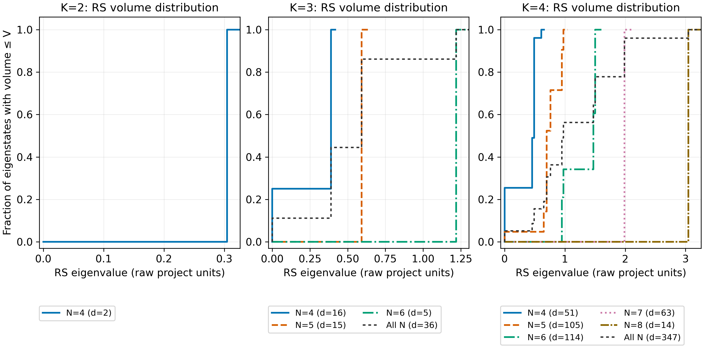

# Closed states and RS volume at fixed area, with variable face number

Calculated on 2026-10-08. This catalogue covers every closed basis state at $K=2,3,4$, with labelled positive-spin faces and $4\le N\le2K$. There are 385 independent states across these three areas, organized into 112 face-spin blocks. The integer enumeration is exact. Operator matrices and spectra are evaluated in floating point by complete finite-block diagonalization.

## Contents

- [State space and basis](#state-space-and-basis)
- [Volume convention](#volume-convention)
- [State counts and volume means](#state-counts-and-volume-means)
- [Complete catalogue by spin pattern](#complete-catalogue-by-spin-pattern)
- [Distributions and mean volume](#distributions-and-mean-volume)
- [An analytic control](#an-analytic-control)
- [Checks and numerical precision](#checks-and-numerical-precision)
- [Files, storage and reproduction](#files-storage-and-reproduction)
- [Interpretation and limits](#interpretation-and-limits)

## State space and basis

A face has a half-integer spin $j_i>0$. We use $K=\sum_i j_i=N_{\rm bosons}/2$ for total linear area and $J=0$ for total angular momentum, meaning closure. This linear area differs from the usual LQG area involving $\sqrt{j_i(j_i+1)}$.

Since each active face contributes at least $1/2$, fixed $K$ allows only $N\le2K$. The complete space considered here is

$$
\mathcal H(K)=\bigoplus_{N=4}^{2K}
\bigoplus_{\substack{j_i>0\\\sum_i j_i=K}}
\operatorname{Inv}_{SU(2)}\left(\bigotimes_i V^{j_i}\right).
$$

Faces are labelled. Assignments differing by a permutation count separately. The displayed sorted patterns below organize the catalogue for readability without identifying these states.

For each positive integer composition $(n_1,\ldots,n_N)$ of $2K$, set $j_i=n_i/2$. Couple spins sequentially:

$$
s_1=j_1,\qquad s_r\in\{|s_{r-1}-j_r|,\ldots,s_{r-1}+j_r\},\qquad s_N=0.
$$

Every admissible path specifies one orthonormal state. Its magnetic-basis coefficient is

$$
B_{\mathbf m,\mathbf s}=\prod_{r=2}^N
C^{s_r,M_r}_{s_{r-1},M_{r-1};j_r,m_r},
\qquad M_r=\sum_{i=1}^r m_i,
$$

using the Condon–Shortley convention. Initial CG coefficients are computed with exact half-integer arguments, then converted to floating point. The normalized states with a given $K$ include continuously many superpositions; the finite catalogue counts independent basis vectors.

For fixed $N$, the dimension allowing zero-spin faces is

$$
d_N(K)=\frac1{K+1}\binom{K+N-1}{K}\binom{K+N-2}{K}.
$$

For $K>0$, put $d_0=d_1=0$. Removing zero-spin faces by inclusion–exclusion gives

$$
d_N^+(K)=\sum_{r=0}^N(-1)^r\binom Nr d_{N-r}(K).
$$

This dimension formula is from [Freidel–Livine, Eq. (12)](https://arxiv.org/html/1005.2090#S2.SS1); positivity of the face spins is an additional restriction used here.

## Volume convention

For each ordered triple with $i<j<k$,

$$
q_{ijk}=\mathbf J_i\cdot(\mathbf J_j\times\mathbf J_k)
=i[\mathbf J_i\cdot\mathbf J_j,\mathbf J_j\cdot\mathbf J_k].
$$

The positive RS operator in the existing repository convention is

$$
V_{\rm RS}=(\gamma\hbar)^{3/2}\sum_{i<j<k}\sqrt{|q_{ijk}|},
\qquad \gamma=0.2375,\quad\hbar=1.
$$

The square roots are taken before the triple contributions are summed. We diagonalize that complete positive sum to obtain volume eigenstates. Its kernel is the intersection of all triple kernels, checked independently using $\sum_{i<j<k}q_{ijk}^2$.

Values below are raw project units. No tetrahedron conversion factor is extended to higher face numbers. Absolute physical regularization factors remain unresolved. AL volume is unevaluated in this catalogue because graph-orientation signs for higher face numbers have not been specified.

## State counts and volume means

The positive and zero counts refer to volume eigenstates, with multiplicity. Equal-weight means are traces divided by the full closed-space dimension, including its kernel.

| $K$ | $N$ | Closed dimension | Zero volume | Positive volume | Mean RS volume |
|---:|---:|---:|---:|---:|---:|
| 2 | 4 | 2 | 0 | 2 | 0.304653190 |
| 3 | 4 | 16 | 4 | 12 | 0.291984083 |
| 3 | 5 | 15 | 0 | 15 | 0.592414237 |
| 3 | 6 | 5 | 0 | 5 | 1.218612761 |
| 4 | 4 | 51 | 13 | 38 | 0.361454580 |
| 4 | 5 | 105 | 5 | 100 | 0.746003801 |
| 4 | 6 | 114 | 0 | 114 | 1.308829813 |
| 4 | 7 | 63 | 0 | 63 | 1.988790910 |
| 4 | 8 | 14 | 0 | 14 | 3.046531902 |

Pooling all allowed face counts at each area:

| $K$ | Closed dimension | Zero volume | Positive volume | Mean RS volume | Distinct eigenvalues, including zero if present |
|---:|---:|---:|---:|---:|---:|
| 2 | 2 | 0 | 2 | 0.304653190 | 1 |
| 3 | 36 | 4 | 32 | 0.545861741 | 4 |
| 4 | 347 | 18 | 329 | 1.192842811 | 14 |

At $K=4,N=4$, there are 38 positive-volume eigenstates. The preceding calculation reported 39 recoupling basis states with positive volume expectations. These counts answer different questions: a basis state can overlap both the volume kernel and a positive eigenspace.

## Complete catalogue by spin pattern

For each row, the spectrum and its multiplicities apply to one labelled face-spin assignment. Multiply by the number of assignments to obtain that pattern's total contribution. All permutations have the same RS spectrum, as verified numerically. Decimal eigenvalues are rounded here; [spectra.csv](spectra.csv) and metadata retain full numerical precision.

| $K$ | $N$ | Sorted face spins | Labelled assignments | Singlets per assignment | RS eigenvalue × multiplicity per assignment |
|---:|---:|---|---:|---:|---|
| 2 | 4 | (0.5,0.5,0.5,0.5) | 1 | 2 | 0.304653190 × 2 |
| 3 | 4 | (0.5,0.5,0.5,1.5) | 4 | 1 | 0 × 1 |
| 3 | 4 | (0.5,0.5,1,1) | 6 | 2 | 0.389312110 × 2 |
| 3 | 5 | (0.5,0.5,0.5,0.5,1) | 5 | 3 | 0.592414237 × 3 |
| 3 | 6 | (0.5,0.5,0.5,0.5,0.5,0.5) | 1 | 5 | 1.218612761 × 5 |
| 4 | 4 | (0.5,0.5,1,2) | 12 | 1 | 0 × 1 |
| 4 | 4 | (0.5,0.5,1.5,1.5) | 6 | 2 | 0.455562777 × 2 |
| 4 | 4 | (0.5,1,1,1.5) | 12 | 2 | 0.489534062 × 2 |
| 4 | 4 | (1,1,1,1) | 1 | 3 | 0 × 1; 0.609306380 × 2 |
| 4 | 5 | (0.5,0.5,0.5,0.5,2) | 5 | 1 | 0 × 1 |
| 4 | 5 | (0.5,0.5,0.5,1,1.5) | 20 | 3 | 0.695807572 × 2; 0.762324874 × 1 |
| 4 | 5 | (0.5,0.5,1,1,1) | 10 | 4 | 0.650782800 × 1; 0.949101436 × 2; 0.976174200 × 1 |
| 4 | 6 | (0.5,0.5,0.5,0.5,0.5,1.5) | 6 | 4 | 0.950269959 × 4 |
| 4 | 6 | (0.5,0.5,0.5,0.5,1,1) | 15 | 6 | 0.976174200 × 1; 1.472589521 × 2; 1.501773802 × 3 |
| 4 | 7 | (0.5,0.5,0.5,0.5,0.5,0.5,1) | 7 | 9 | 1.988790910 × 9 |
| 4 | 8 | (0.5,0.5,0.5,0.5,0.5,0.5,0.5,0.5) | 1 | 14 | 3.046531902 × 14 |

For example, $(1/2,1/2,1,1)$ at $K=3,N=4$ has six labelled assignments and two singlets per assignment, contributing 12 positive-volume eigenstates.

## Distributions and mean volume


Blue denotes positive-volume eigenstates and hatched grey denotes the kernel. Numbers above each bar give the full closed dimension; numbers inside grey segments give the kernel dimension. [Vector PDF](../../figures/variable-n-volume/closed_state_counts.pdf).



Each step curve gives the fraction of independent eigenstates with volume at most the horizontal-axis value. Within a fixed $K,N$, states have equal weights. The pooled curve weights each $N$ by its dimension, so it treats every state at fixed $K$ equally. It does not give each face number equal weight. [Vector PDF](../../figures/variable-n-volume/rs_volume_distributions.pdf).


At each of the three tested areas, the mean raw RS volume increases with the active face number. The connections guide the eye between discrete values of $N$. This concerns the declared sum of positive triple roots and the chosen equal-weight ensembles; it does not establish a universal classical-polyhedron volume law. [Vector PDF](../../figures/variable-n-volume/rs_volume_means.pdf).

## An analytic control

When every face has spin $1/2$, $N=2K$. On three spin-$1/2$ factors, the signed triple has eigenvalues $0,\pm\sqrt3/4$. More precisely,

$$
q_{ijk}^2=\frac3{16}P_{ijk}^{(1/2)},\qquad
P_{ijk}^{(1/2)}=\frac12-\frac23
(\mathbf J_i\cdot\mathbf J_j+\mathbf J_i\cdot\mathbf J_k+\mathbf J_j\cdot\mathbf J_k),
$$

where the projector selects resultant triple spin $1/2$. Thus

$$
\sqrt{|q_{ijk}|}=\sqrt{\frac{\sqrt3}{4}}P_{ijk}^{(1/2)}.
$$

In the full singlet space, $\sum_{i<j}\mathbf J_i\cdot\mathbf J_j=-3N/8$, and every pair occurs in $N-2$ triples. Therefore

$$
V_{\rm RS}\big|_{\mathcal H_{(1/2)^N}}
=(\gamma\hbar)^{3/2}\sqrt{\frac{\sqrt3}{4}}\,
\frac{N(N^2-4)}{12}\,I.
$$

The exact eight-dimensional triple identity and eigenvalues are checked with symbolic rational/radical arithmetic. This proves constant volume across the entire all-spin-$1/2$ singlet space. The numerical catalogue reproduces:

| $K$ | $N$ | Multiplicity | RS eigenvalue |
|---:|---:|---:|---:|
| 2 | 4 | 2 | 0.304653190236 |
| 3 | 6 | 5 | 1.218612760946 |
| 4 | 8 | 14 | 3.046531902364 |

Assignments satisfying $j_{\max}=\sum_{i\ne\max}j_i$ have a single singlet and zero volume; they also pass as degenerate controls. The remaining $K=4,N=4$ kernel mode is in the three-dimensional $(1,1,1,1)$ singlet block.

## Checks and numerical precision

Every completed block passes:

- Exact path counting, independent magnetic multiplicity $\dim(M=0)-\dim(M=1)$, and inclusion–exclusion dimensions.
- Basis normalization, orthogonality, total raising/lowering closure and total Casimir $J(J+1)=0$.
- All intermediate prefix Casimirs against their coupling labels.
- Triple Hermiticity and invariance of the singlet subspace.
- Every canonical-pattern triple against two direct epsilon contractions: sparse local-spin actions and dense tensor matrix elements.
- Positive triple roots computed in the complete $M=0$ magnetic space and then projected, compared with singlet-space roots.
- RS spectra under all labelled permutations, and all active four-face spectra against the previous saved calculation.
- Volume kernel counts against the common triple kernel, analytic spin-$1/2$ volumes, and saturated-spin zero-volume controls.
- Eigensystems, trace moments, and lossless compressed archive reloads.

The largest recorded construction residual is $2.85\times10^{-14}$ (rounded upward). A separate saved-archive reconstruction checks all 112 blocks and 385 eigenstates, with largest residual $3.56\times10^{-15}$ (rounded upward). The absolute comparison and eigenvalue-grouping tolerance is $2\times10^{-10}$. Triple eigenvalues with magnitude at most $64\epsilon_{\rm mach}\max(1,\max|\lambda|)$ are set to zero before taking roots.

Volume eigenvalues within the comparison tolerance of zero are classified as kernel modes. Nearby levels are grouped within the stated absolute tolerance, with the group spread saved. This catalogue has no omitted face-spin assignments or sampled states in its declared range. Numerical matrices and decimal spectra should not be described as algebraically exact.

Plot checks verify data hashes, dimensions, multiplicities, means, variances, monotone normalized cumulative distributions, text bounds, and 300-DPI PNG metadata. The exported figures were visually inspected.

## Files, storage and reproduction

- [summary.json](summary.json): conventions, per-area and per-face counts, spectra, units and source versions.
- [spectra.csv](spectra.csv): eigenvalues and multiplicities for each $K,N$ and pooled $K$.
- [verification.json](verification.json): exact spin-$1/2$ control, saved-archive verification and source hashes.
- For every $K,N$: readable `basis_kK_nN.csv`, `eigenstates_kK_nN.csv`, `metadata_kK_nN.json`, and `operators_kK_nN.npz`.
- [Plot provenance](../../figures/variable-n-volume/plot_summary.json): backing-data hashes and checks.

The nine compressed operator archives total about 0.77 MB. The largest singlet block is $14\times14$; the largest $M=0$ magnetic basis has 70 rows. Each archive retains all scalar products and triples, the complete RS operator and its square, its eigensystem, twice-integer spin/coupling labels, magnetic occupations and the CSR basis transformation. Packed ragged arrays preserve every saved entry without pickle.

Eigenvector columns refer to the recoupling basis in the same block. For degenerate eigenvalues, the chosen numerical eigenvectors are an arbitrary orthonormal basis of the eigenspace; the eigenspace and multiplicity have invariant meaning. Matrix row labels and transformations allow reconstruction in the magnetic occupation basis.

Load one block with `code/python` on the Python import path:

```python
import numpy as np
from closed_basis_volume import load_block

with np.load("results/variable-n-volume/operators_k4_n8.npz", allow_pickle=False) as archive:
    arrays = {name: archive[name] for name in archive.files}
volume = load_block(arrays, 0, "v_rs")
values = load_block(arrays, 0, "eigenvalues")
vectors = load_block(arrays, 0, "eigenvectors")
paths = load_block(arrays, 0, "twice_paths") / 2
```

Reproduce using NumPy, SciPy, SymPy and Matplotlib:

```bash
OPENBLAS_NUM_THREADS=1 python code/python/variable_n_volume.py
OPENBLAS_NUM_THREADS=1 python code/python/verify_variable_n_volume.py
MPLCONFIGDIR=/tmp/lqg-variable-n-mpl python code/python/plot_variable_n_volume.py
```

The driver defaults to $K=2,3,4$ and rejects requests outside that validated scope. The composition and coupling functions themselves support general face numbers. Source: [calculator](../../code/python/variable_n_volume.py), [verification](../../code/python/verify_variable_n_volume.py), [plotting](../../code/python/plot_variable_n_volume.py).

## Interpretation and limits

This is a single-copy, zero-temperature quantum catalogue. Equal weights are an explicitly chosen way to summarize its states. A canonical ensemble requires an additional Hamiltonian and temperature weights.

Closure and positive RS volume do not reconstruct a unique classical polyhedron or prove a classical-volume interpretation for the higher-valence operator. Higher $K$, physical normalization, AL embedding/orientation data, and permutation-equivalence prescriptions remain possible follow-up studies.
