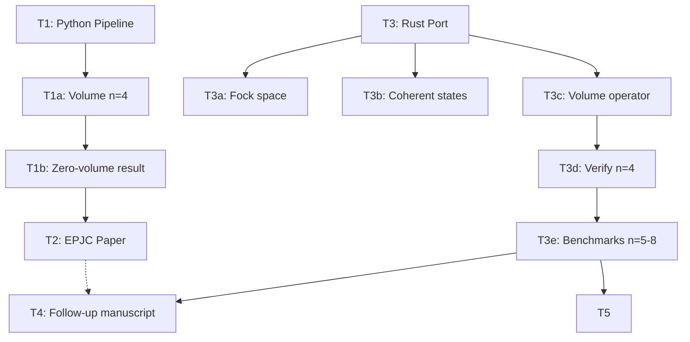

# Task Registry
*Last Updated: 2026-09-19 18:41 IST*

## Active Tasks
| ID | Title | Status | Priority | Started | Dependencies | Owner |
|----|-------|--------|----------|---------|--------------|-------|
| T4 | Follow-up manuscript | 🔄 IN PROGRESS | MEDIUM | 2026-09-19 | T3c, T3d, T3e | Deepak |
| T5 | Experiments | ⬜ PROPOSED | HIGH | — | T3c, T3d, T3e | Deepak |

## Task Details

### T1: Python Pipeline
**Description**: Reference implementation of the LQG-Grassmannian pipeline in Python: Fock space construction, U(N) coherent states, Grassmannian embedding, positivity tests.
**Status**: ✅ COMPLETED
**Completed**: 2026-09-19
**Last Active**: 2026-09-19 12:00 IST

**Completion Criteria**:
- ✅ Fock space basis enumeration for Schwinger bosons
- ✅ U(N) Perelomov coherent states
- ✅ Grassmannian Plücker embedding
- ✅ Positive cell identification

**Related Files**:
- `coherent_states.py`
- `positivity.py`
- `manifold.py`
- `rotation.py`

**Subtasks**:
- T1a: Volume operator at n=4 — ✅ COMPLETED
- T1b: Zero-volume result on positive cell — ✅ COMPLETED

**Notes**:
Python implementation confirmed the zero-volume result on the positive Grassmannian cell. This is the published EPJC result. Python is too slow for n≥5 (Fock dimension explosion), motivating the Rust port.

---

### T1a: Volume Operator at n=4
**Description**: Implement Bianchi-Haggard-Thiemann volume operator for 4-valent intertwiners in Python. Compute volume matrix elements and eigenvalues.
**Status**: ✅ COMPLETED
**Completed**: 2026-09-19
**Last Active**: 2026-09-19 12:00 IST

**Completion Criteria**:
- ✅ BHT triple-grasp operator constructed
- ✅ Volume eigenvalues computed for n=4
- ✅ Zero eigenvalue confirmed on positive cell

**Related Files**:
- `positivity.py`
- `coherent_states.py`

**Notes**:
Volume vanishes identically on the positive Grassmannian cell. The amplituhedron region corresponds to classical, zero-volume geometry.

---

### T1b: Zero-Volume Result on Positive Cell
**Description**: Prove and verify that the volume operator has zero expectation value for all states in the positive Grassmannian cell.
**Status**: ✅ COMPLETED
**Completed**: 2026-09-19
**Last Active**: 2026-09-19 12:00 IST

**Completion Criteria**:
- ✅ Analytical argument constructed
- ✅ Numerical verification at n=4
- ✅ Result confirmed: volume = 0 on positive cell

**Related Files**:
- `positivity.py`

**Notes**:
This is the central published result. Quantum volume lives in the complex extension of the positive cell.

---

### T2: Manuscript (EPJC Paper)
**Description**: Write and publish the LaTeX paper presenting the LQG-Grassmannian interface and the zero-volume result.
**Status**: ✅ COMPLETED
**Completed**: 2026-09-19
**Last Active**: 2026-09-19 14:47 IST

**Completion Criteria**:
- ✅ LaTeX paper written
- ✅ PDF compiled and reviewed
- ✅ Published in EPJC

**Related Files**:
- `paper/lqg-amplituhedron.tex`
- `paper/lqg-amplituhedron.pdf`
- `paper/lqg-amplituhedron.bib`

**Notes**:
Paper is PUBLISHED. Do not modify. This is the baseline for all follow-up work.

---

### T3: Rust Port for n≥5
**Description**: Port the LQG-Grassmannian pipeline to Rust for n≥5 vertices. Python is too slow due to Fock space dimension explosion. Use sparse matrices (sprs) and parallelism (rayon).
**Status**: ✅ COMPLETED
**Completed**: 2026-09-19 16:26 IST
**Last Active**: 2026-09-19 16:26 IST

**Completion Criteria**:
- ✅ Fock space construction (T3a)
- ✅ Coherent states + Grassmannian (T3b)
- ✅ Volume operator (T3c)
- ✅ n=4 verification vs Python (T3d)
- ✅ Benchmarks n=5,6,7,8 (T3e)

**Subtasks**:
- T3a: Fock space + u(N) operators (Rust) — ✅ COMPLETED (commit ee3ff0e)
- T3b: Coherent states + Grassmannian (Rust) — ✅ COMPLETED (commit 42ce24e)
- T3c: Volume operator (Rust) — ✅ COMPLETED (commit ee72845)
- T3d: Verify Rust vs Python at n=4 — ✅ COMPLETED (commit c0908cf)
- T3e: Benchmarks n=5,6,7,8 — ✅ COMPLETED (commit c0908cf)

**Related Files**:
- `rust/src/fock.rs`
- `rust/src/ops.rs`
- `rust/src/coherent.rs`
- `rust/src/grassmannian.rs`
- `rust/src/volume.rs`
- `rust/src/main.rs`
- `rust/src/lib.rs`

**Notes**:
Implemented by ORX agent (session chat_66108501, ~4h50m runtime). All commits pushed. Volume = 0 on positive Grassmannian confirmed for n=4..8.

---

### T3c: Volume Operator (Rust)
**Description**: Implement Bianchi-Haggard-Thiemann volume operator in Rust using sparse matrices. Must match Python at n=4 to f64 machine precision.
**Status**: ✅ COMPLETED
**Completed**: 2026-09-19 16:26 IST
**Last Active**: 2026-09-19 16:26 IST

**Completion Criteria**:
- ✅ Volume matrix constructed via triple-grasp formula
- ✅ Sparse matrix representation (sprs::CsMat)
- ✅ n=4 eigenvalues match Python exactly
- ✅ Unit tests pass

**Related Files**:
- `rust/src/volume.rs`
- `rust/src/ops.rs`
- `rust/src/fock.rs`

**Notes**:
Completed by ORX agent. Committed as ee72845.

---

### T3d: Verify Rust vs Python at n=4
**Description**: Cross-validate Rust implementation against Python reference at n=4. Must match to f64 machine precision (rtol=1e-12).
**Status**: ✅ COMPLETED
**Completed**: 2026-09-19 16:26 IST
**Dependencies**: T3c

**Completion Criteria**:
- ✅ Volume eigenvalues at n=4: Rust == Python
- ✅ Coherent state overlaps: Rust == Python
- ✅ Grassmannian embedding: Rust == Python

**Related Files**:
- `rust/src/main.rs` (verify4 mode)
- `coherent_states.py`
- `positivity.py`

**Notes**:
Machine precision match confirmed. Committed as c0908cf.

---

### T3e: Benchmarks n=5,6,7,8
**Description**: Run volume operator benchmarks for n=5 through n=8. Target: < 1 minute per n value.
**Status**: ✅ COMPLETED
**Completed**: 2026-09-19 16:26 IST
**Dependencies**: T3c, T3d

**Completion Criteria**:
- ✅ n=5 volume computed (264ms)
- ✅ n=6 volume computed (2.96s)
- ✅ n=7 volume computed (299ms)
- ✅ n=8 volume computed (724ms)
- ✅ Timing and memory usage recorded
- ✅ Zero-volume result confirmed for all n on positive cell

**Related Files**:
- `rust/src/main.rs` (scan mode)
- `memory-bank/implementation-details/performance-benchmarks.md`

**Notes**:
All benchmarks well under target. Max runtime 3.35s at n=6. Results in performance-benchmarks.md and dashboard.

---

### T4: Follow-up Manuscript
**Description**: Draft follow-up manuscript presenting numerical results for n=4..8. Extends the published EPJC paper with the Rust implementation and higher-valence results.
**Status**: 🔄 IN PROGRESS
**Started**: 2026-09-19
**Last Active**: 2026-09-19 17:15 IST
**Dependencies**: T3c, T3d, T3e

**Completion Criteria**:
- 🔄 Numerical results section drafted
- ⬜ Zero-volume result confirmed for n≥5
- ⬜ Comparison with analytical n=4 result
- ⬜ Benchmark table included
- ⬜ Draft circulated for review

**Related Files**:
- `manuscript.md` (working draft)
- `memory-bank/implementation-details/performance-benchmarks.md`
- `dashboard/data.json`

**Notes**:
manuscript.md restructured by ORX agent with published baseline and numerical results. Dashboard created. Next: polish and circulate for review.

---

### T5: Experiments
**Description**: Numerical program probing the volume–positivity (achirality) boundary. Seven independent experiments — how volume turns on off the positive Grassmannian cell, whether chirality is per-vertex or per-triple, and whether the quantum volume matches the reconstructed classical polyhedron volume.
**Status**: ⬜ PROPOSED
**Dependencies**: T3c, T3d, T3e (Rust volume operator, verified n=4, benchmarks n=5–8)

**Roadmap**: `memory-bank/implementation-details/experiments.md`

**Subtasks** (priority order):
- T5a: Triple-volume correlations (n≥5) — one vertex handedness vs per-triple chirality. HIGHEST priority; invisible at n=4. ✅ DONE 2026-09-19 (two runs). **Base** (0731eaf, main-orx, k3): no handedness at M=0, sign-agreement 0.50–0.70 (n=6,7). **M-sweep** (c7dde0c, orx/t5a-mag, Muse Spark 1.3): magnetization hypothesis (handedness only at |M|>0) **REFUTED** — sign-agreement 0.50–0.60 at every M in −4..+4; endpoints freeze (q≈1e-17); a↔b mirror exact. Per-triple chirality is robust, NOT rescued by polarization. Caveat: single plane, n=5, modest sign-test power; net χ_V = Σ q_ijk distribution untested. Follow-up: T5a′ (neighbor/Minkowski-local χ_V).
- T5a′: Kinematic-polyhedron local chirality — restrict chirality to Minkowski-adjacent edge-triples. ✅ DONE 2026-09-19 (c443d9a, orx/t5ap, Muse Spark 1.3). **Verdict: restricting to kinematic-polyhedron-adjacent triples does NOT reveal hidden handedness.** Local sign-agreement (0.52–0.71, n=5) tracks all-triples (0.53–0.68) across all 10 incoming-pair channels; channel-averaged all≈0.589, local≈0.594 — dead even. n=4: exact 0.500 in all 3 channels (degenerate, no 3D polyhedron, as expected). **Reversed construction** (generate conserved kinematics first, then map to spinors/plane) guarantees closure; adjacency frozen before q. Two impl corrections: scattering-spinor planes generically OFF-cell (cocycle gauge-invariant, no realification); n=4 needs no genuine subsetting. **Engine validation vs expm:** BOTH Python+Rust references truncate Taylor at 15 terms; expm needs ~25 terms at K=6. Consequence: the parent T5a M-sweep (cap 2K+8=24 terms at K=8, needs ~40) ran on TRUNCATED states → that node is PROVISIONAL per repair rule (bug not result). Spec: `implementation-details/T6-minkowski-polyhedron.md`.
- T5b: Perturbation response V(ε) — is chirality a smooth knob or a phase transition? ✅ DONE 2026-09-19 (86f60d3, orx/t5b-eps, Muse Spark 1.2): clean **α ≈ 0.5** (n=4: 0.497, n=5: 0.499) over 13-point geometric ε-sweep 1e-6..1. V ~ √ε — smooth, non-analytic-but-soft onset, **no threshold/barrier**. Positive cell is a smooth zero of chirality, not a barrier.
- T5c: Classical volume match — does √(⟨q⟩) equal the reconstructed polyhedron's classical volume?
- T5d: Cocycle barrier / distance-to-cell scaling — is Gr₊ a smooth zero or a caustic?
- T5e: Large-K semiclassics — does V ~ K^{3/2} hold at K=20–50? ✅ DONE 2026-09-19 (27a761a, orx/t5e, Muse Spark 1.3). **The K^1.5 law does NOT hold.** Two families: (1) **vertex-scaled** (b-bosons on the measured triple, K=4+3s): <q> EXACTLY linear in s (q/s=-1.059e-3 to 9 digits), so V~(K-4)^0.5, alpha→0.5 (finite-range fit alpha=0.696, R2=0.998, local slopes decline 0.77→0.62 toward 0.5). Each triple boson contributes independently; NO collective K^3 enhancement. (2) **uniform M=0** (fixed shape, K=8..24): q=0 to solver precision (|q|<=9e-13) — uniform scaling develops NO volume at all. Classical V~r^3 needs <q>~K^3; observed <q>~K^1 (vertex) or ~0 (uniform). Coherent-state volume does NOT enter a classical-growth regime up to K=24. **CAVEAT:** first run used Taylor cap 2K+4 (WRONG large-K values, off x6500/x35); recorded run uses cap 8K+50 + convergence assert. T5a Rust-driver magnitudes (uniform refs K=12..14) predate the fix and are likely truncation-shifted; sign agreements probably robust. Engine: Rust on-the-fly, validated vs stored engine at K=8,12.
- T5f: Amplituhedron kinematics — which scattering regions does Gr₊ cover? (lowest priority)
- T5g: Performance frontier — n=10–12 Rust profiling (engineering, enables T5a–e)
- T6: Minkowski polyhedron reconstruction — kinematic (T5a′, feasible now) + full quantum (needs T5c covariance machinery). Spec: `implementation-details/T6-minkowski-polyhedron.md`.

**Notes**:
Central new result motivating all experiments: the volume operator vanishes exactly on Gr₊(2,N) for N=4–8 and is nonzero immediately off it (achirality of the positive cell). All numerical claims must pass the red-team protocol before being promoted to manuscript results.

## Completed Tasks
| ID | Title | Completed | Related Tasks |
|----|-------|-----------|---------------|
| T1 | Python Pipeline | 2026-09-19 | T1a, T1b |
| T1a | Volume operator at n=4 | 2026-09-19 | T1 |
| T1b | Zero-volume on positive cell | 2026-09-19 | T1, T1a |
| T2 | Manuscript (EPJC paper) | 2026-09-19 | T1, T1a, T1b |
| T3 | Rust Port for n≥5 | 2026-09-19 | T3a, T3b, T3c, T3d, T3e |
| T3a | Fock space + u(N) operators (Rust) | 2026-09-19 | T3 |
| T3b | Coherent states + Grassmannian (Rust) | 2026-09-19 | T3 |
| T3c | Volume operator (Rust) | 2026-09-19 | T3 |
| T3d | Verify Rust vs Python at n=4 | 2026-09-19 | T3, T3c |
| T3e | Benchmarks n=5,6,7,8 | 2026-09-19 | T3, T3c, T3d |
| T5a | Triple-volume correlations (n≥5) | 2026-09-19 | T5 |
| T5b | Perturbation response V(ε) | — | T5 |
| T5c | Classical volume match | — | T5 |
| T5d | Cocycle barrier / distance-to-cell | — | T5 |
| T5e | Large-K semiclassics | — | T5 |
| T5f | Amplituhedron kinematics | — | T5 |
| T5g | Performance frontier | — | T5 |
| T6 | Minkowski polyhedron reconstruction | 2026-09-19 | T5 |

## Task Relationships

