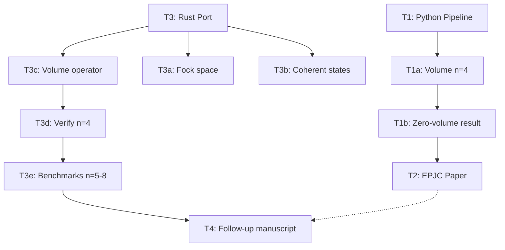

# Task Registry
*Last Updated: 2026-09-19 16:30 IST*

## Active Tasks
| ID | Title | Status | Priority | Started | Dependencies | Owner |
|----|-------|--------|----------|---------|--------------|-------|
| T3c | Volume operator (Rust) | 🔄 IN PROGRESS | HIGH | 2026-09-19 | T3a, T3b | ORX agent |

## Task Details

### T1: Python Pipeline
**Description**: Reference implementation of the LQG-Grassmannian pipeline in Python: Fock space construction, U(N) coherent states, Grassmannian embedding, positivity tests.
**Status**: ✅ COMPLETED
**Completed**: 2026-09-19
**Last Active**: 2026-09-19 12:00 IST

**Completion Criteria**:
- ✅ Fock space basis enumeration for Schwinger bosons
- ✅ U(N) Perelomov coherent states
- ✅ Grassmannian Plücker embedding
- ✅ Positive cell identification

**Related Files**:
- `coherent_states.py`
- `positivity.py`
- `manifold.py`
- `rotation.py`

**Subtasks**:
- T1a: Volume operator at n=4 — ✅ COMPLETED
- T1b: Zero-volume result on positive cell — ✅ COMPLETED

**Notes**:
Python implementation confirmed the zero-volume result on the positive Grassmannian cell. This is the published EPJC result. Python is too slow for n≥5 (Fock dimension explosion), motivating the Rust port.

---

### T1a: Volume Operator at n=4
**Description**: Implement Bianchi-Haggard-Thiemann volume operator for 4-valent intertwiners in Python. Compute volume matrix elements and eigenvalues.
**Status**: ✅ COMPLETED
**Completed**: 2026-09-19
**Last Active**: 2026-09-19 12:00 IST

**Completion Criteria**:
- ✅ BHT triple-grasp operator constructed
- ✅ Volume eigenvalues computed for n=4
- ✅ Zero eigenvalue confirmed on positive cell

**Related Files**:
- `positivity.py`
- `coherent_states.py`

**Notes**:
Volume vanishes identically on the positive Grassmannian cell. The amplituhedron region corresponds to classical, zero-volume geometry.

---

### T1b: Zero-Volume Result on Positive Cell
**Description**: Prove and verify that the volume operator has zero expectation value for all states in the positive Grassmannian cell.
**Status**: ✅ COMPLETED
**Completed**: 2026-09-19
**Last Active**: 2026-09-19 12:00 IST

**Completion Criteria**:
- ✅ Analytical argument constructed
- ✅ Numerical verification at n=4
- ✅ Result confirmed: volume = 0 on positive cell

**Related Files**:
- `positivity.py`

**Notes**:
This is the central published result. Quantum volume lives in the complex extension of the positive cell.

---

### T2: Manuscript (EPJC Paper)
**Description**: Write and publish the LaTeX paper presenting the LQG-Grassmannian interface and the zero-volume result.
**Status**: ✅ COMPLETED
**Completed**: 2026-09-19
**Last Active**: 2026-09-19 14:47 IST

**Completion Criteria**:
- ✅ LaTeX paper written
- ✅ PDF compiled and reviewed
- ✅ Published in EPJC

**Related Files**:
- `paper/lqg-amplituhedron.tex`
- `paper/lqg-amplituhedron.pdf`
- `paper/lqg-amplituhedron.bib`

**Notes**:
Paper is PUBLISHED. Do not modify. This is the baseline for all follow-up work.

---

### T3: Rust Port for n≥5
**Description**: Port the LQG-Grassmannian pipeline to Rust for n≥5 vertices. Python is too slow due to Fock space dimension explosion. Use sparse matrices (sprs) and parallelism (rayon).
**Status**: 🔄 IN PROGRESS
**Started**: 2026-09-19
**Last Active**: 2026-09-19 16:08 IST

**Completion Criteria**:
- ✅ Fock space construction (T3a)
- ✅ Coherent states + Grassmannian (T3b)
- 🔄 Volume operator (T3c)
- ⏳ n=4 verification vs Python (T3d)
- ⏳ Benchmarks n=5,6,7,8 (T3e)

**Subtasks**:
- T3a: Fock space + u(N) operators (Rust) — ✅ COMPLETED (commit ee3ff0e)
- T3b: Coherent states + Grassmannian (Rust) — ✅ COMPLETED (commit 42ce24e)
- T3c: Volume operator (Rust) — 🔄 IN PROGRESS
- T3d: Verify Rust vs Python at n=4 — ⏳ PENDING
- T3e: Benchmarks n=5,6,7,8 — ⏳ PENDING

**Related Files**:
- `rust/src/fock.rs`
- `rust/src/ops.rs`
- `rust/src/coherent.rs`
- `rust/src/grassmannian.rs`
- `rust/src/volume.rs`
- `rust/src/main.rs`
- `rust/src/lib.rs`

**Notes**:
Being implemented by ORX agent (session chat_66108501). Agent has been instructed to update manuscript.md with new numerical results as they arrive.

---

### T3c: Volume Operator (Rust)
**Description**: Implement Bianchi-Haggard-Thiemann volume operator in Rust using sparse matrices. Must match Python at n=4 to f64 machine precision.
**Status**: 🔄 IN PROGRESS
**Started**: 2026-09-19
**Last Active**: 2026-09-19 16:08 IST

**Completion Criteria**:
- Volume matrix constructed via triple-grasp formula
- Sparse matrix representation (sprs::CsMat)
- n=4 eigenvalues match Python exactly
- Unit tests pass

**Related Files**:
- `rust/src/volume.rs`
- `rust/src/ops.rs`
- `rust/src/fock.rs`

**Notes**:
Currently being debugged by ORX agent. Binary rebuilt at 16:08 IST.

---

### T3d: Verify Rust vs Python at n=4
**Description**: Cross-validate Rust implementation against Python reference at n=4. Must match to f64 machine precision (rtol=1e-12).
**Status**: ⏳ PENDING
**Dependencies**: T3c

**Completion Criteria**:
- Volume eigenvalues at n=4: Rust == Python
- Coherent state overlaps: Rust == Python
- Grassmannian embedding: Rust == Python

**Related Files**:
- `rust/src/main.rs` (scan mode)
- `coherent_states.py`
- `positivity.py`

---

### T3e: Benchmarks n=5,6,7,8
**Description**: Run volume operator benchmarks for n=5 through n=8. Target: < 1 minute per n value.
**Status**: ⏳ PENDING
**Dependencies**: T3c, T3d

**Completion Criteria**:
- n=5 volume computed
- n=6 volume computed
- n=7 volume computed
- n=8 volume computed
- Timing and memory usage recorded
- Zero-volume result confirmed for all n on positive cell

**Related Files**:
- `rust/src/main.rs` (scan mode)
- `memory-bank/implementation-details/performance-benchmarks.md`

---

### T4: Follow-up Manuscript
**Description**: Draft follow-up manuscript presenting numerical results for n=4..8. Extends the published EPJC paper with the Rust implementation and higher-valence results.
**Status**: ⏳ PENDING
**Dependencies**: T3c, T3d, T3e

**Completion Criteria**:
- Numerical results section written
- Zero-volume result confirmed for n≥5
- Comparison with analytical n=4 result
- Benchmark table included
- Draft circulated for review

**Related Files**:
- `manuscript.md` (working draft)
- `memory-bank/implementation-details/performance-benchmarks.md`

**Notes**:
manuscript.md should be updated by ORX agent as numerical results arrive. The published paper (paper/lqg-amplituhedron.tex) is frozen.

## Completed Tasks
| ID | Title | Completed | Related Tasks |
|----|-------|-----------|---------------|
| T1 | Python Pipeline | 2026-09-19 | T1a, T1b |
| T1a | Volume operator at n=4 | 2026-09-19 | T1 |
| T1b | Zero-volume on positive cell | 2026-09-19 | T1, T1a |
| T2 | Manuscript (EPJC paper) | 2026-09-19 | T1, T1a, T1b |

## Task Relationships

