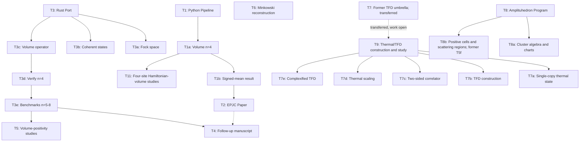

# Task Registry
*Last Updated: 2026-10-10 03:26:38 IST*

## Active Tasks
| ID | Title | Status | Priority | Started | Dependencies | Details |
|----|-------|--------|----------|---------|--------------|---------|
| T1a | Positive RS/AL volume and FL shape checks | 🔄 IN PROGRESS | HIGH | 2026-09-19 | T1 | [Details](tasks/T1a.md) |
| T3c | Positive-volume construction and validation in Rust | 🔄 IN PROGRESS | HIGH | 2026-09-19 | T3 | [Details](tasks/T3c.md) |
| T3e | Independent n=6 benchmark check | 🔄 IN PROGRESS | HIGH | 2026-09-19 | T3c, T3d | [Details](tasks/T3e.md) |
| T4 | Follow-up manuscript claim audit and review | 🔄 IN PROGRESS | HIGH | 2026-09-19 | T3c, T3d, T3e, T5, T9 | [Details](tasks/T4.md) |
| T5 | Volume–positivity numerical studies | 🔄 IN PROGRESS | HIGH | 2026-09-19 | T3c, T3d, T3e | [Details](tasks/T5.md) |
| T5c | FL classical/quantum tetrahedron-volume comparison | 🔄 IN PROGRESS | HIGH | 2026-09-19 | T5, T3c | [Details](tasks/T5c.md) |
| T5d | Cocycle phase and distance-to-cell response | 🔄 IN PROGRESS | HIGH | 2026-09-19 | T5, T3c | [Details](tasks/T5d.md) |
| T5g | Higher-valence performance frontier | 🔄 IN PROGRESS | MEDIUM | 2026-09-19 | T3c | [Details](tasks/T5g.md) |
| T6 | Minkowski polyhedron reconstruction and quantum bridge | 🔄 IN PROGRESS | HIGH | 2026-09-19 | T5a′, T5c | [Details](tasks/T6.md) |
| T8 | Amplituhedron Program | 🔄 IN PROGRESS | MEDIUM | 2026-10-04 | T1, T2 | [Details](tasks/T8.md) |
| T9 | Thermal/TFD state construction and physical study | 🔄 IN PROGRESS | HIGH | 2026-10-06 | T3c | [Details](tasks/T9.md) |
| T11 | Four-site Hamiltonian–volume studies | 🔄 IN PROGRESS | HIGH | 2026-10-09 | T1a | [Details](tasks/T11.md) |
| T8a | Cluster algebra and coordinate charts | 🔄 IN PROGRESS | MEDIUM | 2026-10-04 | T8 | [Details](tasks/T8a.md) |
| T8b | Positive cells and scattering regions | 🔄 IN PROGRESS | MEDIUM | 2026-10-04 | T8, T1, T2 | [Details](tasks/T8b.md) |

## Task Details

### T1: Python Pipeline
**Details:** [Archived task record](archive/T1.md)
**Description**: Reference implementation of the LQG-Grassmannian pipeline in Python: Fock space construction, U(N) coherent states, Grassmannian embedding, positivity tests.
**Status**: ✅ COMPLETED
**Completed**: 2026-09-19
**Last Active**: 2026-09-19 12:00 IST

**Completion Criteria**:
- ✅ Fock space basis enumeration for Schwinger bosons
- ✅ U(N) Perelomov coherent states
- ✅ Grassmannian Plücker embedding
- ✅ Positive cell identification

**Related Files**:
- `code/python/coherent_states.py`
- `code/python/positivity.py`
- `manifold.py`
- `rotation.py`

**Subtasks**:
- T1a: Positive RS/AL implementation — ✅; FL equal-area validation, weighted-area extension, and boundary comparison — 🔄 IN PROGRESS ([record](tasks/T1a.md))
- T1b: Signed-mean cancellation and positive-volume check on real planes — ✅ COMPLETED ([record](archive/T1b.md))

**Notes**:
The Python implementation established the real-plane cancellation of the
signed triple-grasp mean. The red-team audit shows this is not a zero-volume
operator result; the numerical baseline has now been rerun to convergence.

---

### T1a: Volume Operator at n=4
**Description**: Implement positive RS and AL volume expectations in Python and validate at n=4.
**Status**: 🔄 IN PROGRESS
**Last Active**: 2026-10-03 11:48:38 IST

**Completion Criteria**:
- ✅ Positive RS and AL expectations implemented by exact active-sector spectral decomposition
- ✅ Paired spin-1/2 singlet and collinear controls checked against an independent tensor-product calculation
- ✅ Preliminary Python evaluation of the EPJC Eq. (38) FL fixed-area coherent state on a regular tetrahedron gives positive RS and AL volumes.
- ✅ Rebuild independent local-spin tensor-product blocks; with a shared scale-aware numerical zero-mode cutoff, RS/AL agree with project routines below $7\times10^{-18}$ at $J=2$ and within $1.67\times10^{-16}$ over $J=1\ldots5$.
- ✅ At $J=2$, both sampled RS/AL minima in the 440-point ordered equal-face-area grid occur at the regular tetrahedron. This is a grid observation, not a global-minimum proof.
- ✅ At $J=2$, strict-positive face-spin enumeration yields one assignment $(1/2,1/2,1/2,1/2)$ with two recoupling channels. This is discrete-label enumeration, not a count of shapes.
- 🔄 Extend validation and select physical regularization prefactors
- 🔄 Replace dense diagonalization before evaluating active blocks above dimension 512

**Related Files**:
- `code/python/positivity.py`
- `code/python/coherent_states.py`
- `code/python/fl_volume_shape_scan.py`
- `code/python/fl_volume_labels.py`
- `notes/experiments/fl_volume_shape_scan_log.md`
- **Individual Task File**: [T1a details](tasks/T1a.md)

**Notes**:
The historical volume values were square roots of signed-grasp means, not
positive volume expectations. The new exact small-block RS/AL routines give
nonzero volume on a paired spin-1/2 singlet even though $\langle q_{012}\rangle=0$.
The EPJC Eq. (38) fixed-area state evaluated in Python is the Freidel–Livine (FL) state. FL names this fixed-area construction; Freidel–Speziale (FS) supplies the spinorial phase-space framework and is not a separate target state family here. The regular-tetrahedron sweep over $J=1\ldots5$ gives positive RS and AL volume expectations. A shared scale-aware numerical zero-mode cutoff reduces direct-tensor expectation differences to at most $1.67\times10^{-16}$; direct-tensor triple matrices agree within $2.8\times10^{-15}$. The Rust Eq. (38) example now matches the Python $J=2$ values at the displayed precision. The area-dependence plot is live in the dashboard published from website commit `824b2b8` (workflow `36990851937`); local shape and data assets were refreshed with the cutoff.

At $J=2$, the equal-face-area scan evaluates 440 ordered shapes and finds the regular tetrahedron as the sampled RS and AL minimum. Its exact degenerate boundaries are excluded, so this does not establish a global minimum or explain the quantum behavior near classical zero-volume directions. The allowed-label script finds one strict positive assignment with two recoupling channels; shape sampling for unequal assignments remains open. The first shape-thumbnail version was deployed at `f0b6fdd`; the latest visual update, which reuses saved shape thumbnails and adds T5c previews, is website commit `9c6670c` (workflow `37125090987`). The earlier unsaved inline discrepancy remains unrecoverable. Physical prefactors, boundary-limit/fluctuation analysis, and broader validation remain open. See `implementation-details/volume-operator.md` and `notes/experiments/fl_volume_shape_scan_log.md`.

---

### T1b: Signed-mean result on real planes
**Details:** [Archived task record](archive/T1b.md)
**Description**: Establish the signed triple-grasp cancellation on real planes and test what it implies for a positive volume operator.
**Status**: ✅ COMPLETED
**Completed**: 2026-10-03
**Last Active**: 2026-10-03 11:48:38 IST

**Completion Criteria**:
- ✅ Analytical argument constructed
- ✅ Numerical verification at n=4
- ✅ Result confirmed: $\langle q\rangle=0$ for real-plane states
- ✅ Evaluate positive RS and AL operators on a strictly positive real plane and a real plane outside the positive cell, with an independent local-spin tensor-product check.

**Related Files**:
- `code/python/positivity.py`
- `code/python/real_plane_volume.py`
- `results/t1b_real_plane_volume_results.json`
- [Shared volume numerical preliminaries](implementation-details/volume-numerical-preliminaries.md)

**Notes**:
The signed-mean cancellation also holds on real planes outside the positive
cell. For the tested $N=4$, $K=6$ Perelomov states, $\langle q_{012}\rangle=0$
to floating-point precision while $V_{RS}=0.1205292375514575$ and
$V_{AL}=0.0751162653864954$ in project units. Both the strictly positive and
off-cell examples have nonzero positive volume. The AL values use regular-
tetrahedron orientation signs $(+,-,+,-)$; this is a two-state numerical
result, not a claim about every real plane or embedding.

---

### T2: Manuscript (EPJC Paper)
**Details:** [Archived task record](archive/T2.md)
**Description**: Write and publish the LaTeX paper presenting the LQG-Grassmannian interface.
**Status**: ✅ COMPLETED
**Completed**: 2026-09-19
**Last Active**: 2026-09-19 14:47 IST

**Completion Criteria**:
- ✅ LaTeX paper written
- ✅ PDF compiled and reviewed
- ✅ Published in EPJC

**Related Files**:
- `code/papers/lqg-amplituhedron.tex`
- `paper/lqg-amplituhedron.pdf`
- `code/papers/lqg-amplituhedron.bib`

**Notes**:
Paper is PUBLISHED. Do not modify. This is the baseline for all follow-up work.

---

### T3: Rust Port for n≥5
**Details:** [Archived task record](archive/T3.md)
**Description**: Port the LQG-Grassmannian pipeline to Rust for n≥5 vertices. Python is too slow due to Fock space dimension explosion. Use sparse matrices (sprs) and parallelism (rayon).
**Status**: ✅ COMPLETED
**Completed**: 2026-09-19 16:26 IST
**Last Active**: 2026-09-19 16:26 IST

**Completion Criteria**:
- ✅ Fock space construction (T3a)
- ✅ Coherent states + Grassmannian (T3b)
- ✅ Volume operator (T3c)
- ✅ n=4 converged state and signed-mean verification (T3d)
- ✅ Converged n=5,6,7,8 Rust scan (T3e); independent n=6 check remains open

**Subtasks**:
- T3a: Fock space + u(N) operators (Rust) — ✅ COMPLETED (commit ee3ff0e; [record](archive/T3a.md))
- T3b: Coherent states + Grassmannian (Rust) — ✅ COMPLETED (commit 42ce24e; [record](archive/T3b.md))
- T3c: Volume operator (Rust) — 🔄 ACTIVE follow-up; [record](tasks/T3c.md)
- T3d: Verify Rust vs Python at n=4 — ✅ CONVERGED RUN RECORDED (2026-10-01; [record](archive/T3d.md))
- T3e: Benchmarks n=5,6,7,8 — ✅ CONVERGED RUN RECORDED; independent n=6 check open ([record](tasks/T3e.md))

**Related Files**:
- `code/rust/src/fock.rs`
- `code/rust/src/ops.rs`
- `code/rust/src/coherent.rs`
- `code/rust/src/grassmannian.rs`
- `code/rust/src/volume.rs`
- `code/rust/src/main.rs`
- `code/rust/src/lib.rs`

**Notes**:
Implemented by ORX agent (session chat_66108501, ~4h50m runtime). Historical
scan used an unconverged Taylor state shared with the Python comparator; the
positive-cell result concerns the signed mean, not the positive volume.

---

### T3c: Volume Operator (Rust)
**Description**: Implement positive RS and AL vertex-volume expectations in Rust and validate at n=4.
**Status**: 🔄 IN PROGRESS
**Last Active**: 2026-10-03 11:48:38 IST

**Completion Criteria**:
- ✅ Triple-grasp matrices constructed from sparse Schwinger generators
- ✅ Positive RS and AL expectations implemented using active-sector spectral decomposition
- ✅ Simple-state Rust results match Python and an independent tensor-product calculation
- ✅ Execute code/rust/examples/fl_volume.rs and compare with the independently validated Python values using the shared numerical zero-mode cutoff
- 🔄 Select physical regularization prefactors
- 🔄 Replace dense diagonalization before evaluating active blocks above dimension 512

**Related Files**:
- `code/rust/src/volume.rs`
- `code/rust/src/ops.rs`
- `code/rust/src/fock.rs`
- **Individual Task File**: [T3c details](tasks/T3c.md)

**Notes**:
The 2026-10-01 audit corrected the old scope: the historical function computed
$\sqrt{|\langle q_{ijk}\rangle|}$, not either volume prescription. The new
operators use dense spectral evaluation with a numerical zero-mode cutoff for
active blocks up to dimension 512; physical constants and large-block methods
remain open. The Rust FL example now matches the Python $J=2$ result after
invoking the installed Rust 1.92 toolchain directly.
The 2026-10-02 U(N) singlet-pair discussion was conceptual; it did not change
or validate the Rust state-construction or volume code.

---

### T3d: Verify Rust vs Python at n=4
**Details:** [Archived task record](archive/T3d.md)
**Description**: Cross-validate Rust implementation against Python reference at n=4. Must match to f64 machine precision (rtol=1e-12).
**Status**: ✅ CONVERGED RUN RECORDED
**Historical run**: 2026-09-19 16:26 IST
**Dependencies**: T3c

**Completion Criteria**:
- ✅ Volume eigenvalues at n=4: Rust == Python
- ✅ Corrected Python state and signed mean match an independent $n=4$ exponential
- ✅ Rust state and signed mean match the corrected Python and independent SciPy reference
- ✅ Grassmannian embedding: Rust == Python

**Related Files**:
- `code/rust/src/main.rs` (verify4 mode)
- `code/python/coherent_states.py`
- `code/python/positivity.py`

**Notes**:
The historical machine-precision match compared states with the same 15-term
Taylor truncation. Independent `expm_multiply` at the canonical complex plane
gives $\langle q\rangle=-0.000827687168$ versus historical
$-0.000849657246$. The corrected core Python path reproduces the independent
value; the converged Rust run reproduces the independent value.

---

### T3e: Benchmarks n=5,6,7,8
**Details:** [Task record](tasks/T3e.md)
**Description**: Run volume operator benchmarks for n=5 through n=8. Target: < 1 minute per n value.
**Status**: ✅ CONVERGED RUN RECORDED
**Historical run**: 2026-09-19 16:26 IST
**Dependencies**: T3c, T3d

**Completion Criteria**:
- ✅ Historical n=5 scan recorded (264ms)
- ✅ Historical n=6 scan recorded (2.96s)
- ✅ Historical n=7 scan recorded (299ms)
- ✅ Historical n=8 scan recorded (724ms)
- ✅ Timing and memory usage recorded
- ✅ Recomputed complex-plane signed means with converged Rust states; these remain signed-mean proxies
- 🔄 Independently check the n=6 point and define a positive volume expectation

**Related Files**:
- `code/rust/src/main.rs` (scan mode)
- `memory-bank/implementation-details/performance-benchmarks.md`

**Notes**:
The converged complex-plane scan was completed on 2026-10-01. SciPy independently checks n=5,7,8; n=6 remains open. Real-plane signed-mean cancellation is analytic.

---

### T4: Follow-up Manuscript
**Details:** [Task record](tasks/T4.md)
**Description**: Draft follow-up manuscript presenting numerical results for n=4..8. Extends the published EPJC paper with the Rust implementation and higher-valence results.
**Status**: 🔄 IN PROGRESS
**Started**: 2026-09-19
**Last Active**: 2026-10-01 21:42 IST
**Dependencies**: T3c, T3d, T3e, T5, T9

**Completion Criteria**:
- ✅ Numerical results through T7e are drafted in `manuscript.md`
- ✅ Baseline Rust/Python comparison and n=4..8 results are recorded
- 🔄 Resolve manuscript/record inconsistencies and qualify provisional findings
- 🔄 Independent red-team audit recorded; central interpretation and baseline revalidation remain open
- ⬜ Circulate corrected draft for review

**Related Files**:
- `manuscript.md` (working draft)
- `memory-bank/implementation-details/performance-benchmarks.md`
- `code/dashboard/data.json`

**Notes**:
The manuscript is a developed draft, not yet circulated. The red-team audit
found that $\sqrt{|\langle q\rangle|}$ is a proxy, real nonpositive planes
also have zero signed mean, and old baseline magnitudes used shared Taylor
truncation. See `memory-bank/implementation-details/red-team-audit.md`.

---

### T5: Volume–Positivity Numerical Studies
**Details:** [Task record](tasks/T5.md)
**Description**: Numerical program probing the volume–positivity (achirality) boundary. Seven independent studies ask how the signed grasp responds off the positive Grassmannian cell, whether chirality is per-vertex or per-triple, and how named quantum observables compare with a reconstructed classical polyhedron volume.
**Status**: 🔄 IN PROGRESS
**Dependencies**: T3c, T3d, T3e (Rust volume operator, verified n=4, benchmarks n=5–8)

**Roadmap**: `memory-bank/implementation-details/volume-positivity-studies.md`

**Subtasks** (priority order):
- T5a: Triple-volume correlations (n≥5; [record](archive/T5a.md)). **Base n=6,7 runs recorded complete**: sign-agreement 0.50–0.70 and small cross-seed correlations, consistent with per-triple chirality; modest sign-test power and n=8 resource limit remain. **Magnetization sweep rerun for one fixed plane**: all 10 states converged in 39–41 Taylor terms; four representative sectors matched independent SciPy exponentiation to at most 3.6e-16 in triple means. Sign-agreement stayed 0.50–0.60 for nonpolarized sectors. The one-plane, ten-triple sample does not establish a general handedness law. See `notes/experiments/t5a_mag_notes.md` and `notes/experiments/t5a_prime_notes.md`.
- T5a′: Kinematic-polyhedron local chirality ([record](archive/T5a′.md)) — **recorded complete with caveats**. The reported n=5 local sign-agreement tracks all-triples across 10 incoming-pair channels; only 8 planes per channel, so sign-test power is limited. n=4 is planar/degenerate for this polyhedron test. Dense-expm validation found the shared 15-term Taylor reference was not converged (about 25 terms needed at K=6); retain the recorded explicit checks and caveats, and do not treat cross-engine agreement under a shared truncation as independent validation. Spec/results: `implementation-details/T6-minkowski-polyhedron.md`, `notes/experiments/t5a_prime_notes.md`.
- T5b: Perturbation response of the signed-mean proxy ([record](archive/T5b.md)) — corrected 13-point
  rerun has convergence assertions and fits α=0.496907 (n=4), 0.499104
  (n=5). Four n=4 and three n=5 points agree with independent SciPy
  exponentiation; generalization across planes remains open.
- T5c: FL classical/quantum tetrahedron-volume comparison ([record](tasks/T5c.md)) — OPEN. The weighted input pilot checks regular and unequal-skew FL states through $J=7$; a nine-shape unequal-area grid covers $J=2,4$, with four selected points at $J=6$; a fixed-$x$ flat path covers $J=2,4,6,7$. Fixed geometry-matched ratios reach $0.953$ (regular) and $0.904$ (unequal skew) at $J=7$. Weighted closure and scalar area means pass. Individual vector means vanish by gauge invariance; shape recovery is checked through correlations, whose unequal-area finite-$J$ error reaches $0.0584$ at $J=7$. The exact flat boundary has nonzero normalized positive volume in the tested range; neither iterated limit is established. Under signs $(+,-,+,-)$, calibrated RS/AL curves coincide by four-valent closure and are not independent evidence. Physical regularization factors and broader shape/large-$J$ scans remain open. See [T5c implementation details](implementation-details/T5c-flux-covariance-volume-comparison.md) and the four `results/t5c_*_results.json` records.
- T5d: Cocycle phase and distance-to-cell response ([record](tasks/T5d.md)) — OPEN. A one-seed Rust pilot tests a Plücker cross-ratio phase; broader families and a separate positivity defect remain open.
- T5e: Large-K semiclassics ([record](archive/T5e.md)) — complete for recorded families through K=24; target K=20–50 was not fully reached. ✅ DONE for the recorded families/range (27a761a, orx/t5e, Muse Spark 1.3). **The K^1.5 law is not supported by these runs.** Two families: (1) **vertex-scaled** (b-bosons on the measured triple, K=4+3s): ⟨q⟩ is linear in s (q/s=-1.059e-3 to 9 digits), so V~(K-4)^0.5 over the measured range. (2) **uniform M=0** (fixed shape, K=8..24): q=0 to solver precision (|q|<=9e-13). Classical V~r^3 would require ⟨q⟩~K^3; these tested families show ⟨q⟩~K^1 or approximately zero. This does not rule out other state families or higher K. **Caveat:** first run used Taylor cap 2K+4 and produced truncation-shifted results; recorded run uses cap 8K+50 plus a convergence assertion. T5a Rust-driver magnitudes at K=12..14 predate the fix and may be shifted. The on-the-fly engine was compared with the stored engine at K=8,12.
- T5f: Amplituhedron kinematics — ownership transferred to T8b; [historical record](archive/T5f.md).
- T5g: Performance frontier ([record](tasks/T5g.md)) — OPEN; n=10–12 Rust profiling if required by the physics runs.
- T6: Minkowski polyhedron reconstruction ([record](tasks/T6.md)) — kinematic implementation and T5a′ pilot exist; full quantum geometry correspondence remains open. Its reconstruction accepts general face areas but does not evaluate FL positive volume. Spec: `implementation-details/T6-minkowski-polyhedron.md`; see also the [T5c specification](implementation-details/T5c-flux-covariance-volume-comparison.md).
- T7: Former thermal/TFD umbrella ([archived record](archive/T7.md)) — **TRANSFERRED TO T9; scientific work remains open.** Completed child records T7a–T7e retain their identifiers and findings under T9.
- T9: Thermal/TFD state construction and physical study ([record](tasks/T9.md)) — **IN PROGRESS; five completed child studies T7a–T7e.** Owns the full construction and analysis program. The user selected the two-copy squeeze of conjugate FL intertwiners with transformed observables; the older one-sided squeeze and conditional singlet remain comparative models. Reduced-state and Gibbs characterization remain open.

**Notes**:
Current supported result: real-plane states have zero signed triple-grasp mean,
including real planes outside Gr₊(2,N). This does not imply zero positive
volume; the tested positive $n=4$ state has nonzero $\langle q^2\rangle$.
Claim promotion requires explicit observable definitions and independent
convergence evidence.

### T8: Amplituhedron Program
**Description**: Organize the project's LQG–Grassmannian/amplituhedron questions, with the published T2 paper as the frozen baseline.
**Status**: 🔄 IN PROGRESS
**Priority**: MEDIUM
**Started**: 2026-10-04
**Subtasks**: T8a cluster algebra/chart relevance; T8b positive-cell/scattering-region mapping, transferred from former T5f.
**Details**: [`tasks/T8.md`](tasks/T8.md); [T8a record](tasks/T8a.md), [T8b record](tasks/T8b.md); see also `implementation-details/grassmannian-embedding.md`.

### T9: Thermal/TFD State Construction and Physical Study
**Details:** [Task record](tasks/T9.md)
**Description**: Own TFD state construction and physical/geometric study; completed child-study records T7a–T7e retain their IDs. The selected T9 state is the same-mode squeeze of conjugate FL intertwiners in both copies, with transformed geometric observables. The four-face $J_{\mathrm{in}}=1$ occupation/resultant-spin distribution is implemented by two methods through $q=160$ and cross-checked; general initial $J$, reduced-state blocks, entanglement, and geometry remain open. A fixed positive total-area Hamiltonian on unrestricted Fock space is excluded as a Gibbs generator by the different low-temperature limits.
**Status**: 🔄 IN PROGRESS
**Dependencies**: T3c
**Subtasks**: Five completed child-study records (T7a–T7e); no additional subtask slots remain.

### T11: Four-site Hamiltonian–volume studies
**Details**: [Task record](tasks/T11.md)
**Description**: Implement the first exact four-site Bose–Hubbard/positive-RS pilot at fixed $K=2,3,4$, comparing complete and ring graphs in the total-spin singlet sector. The run includes no-hopping, free-hopping, repulsion, fixed-$K$ Gibbs observables, ground-state correlations and one-site entropy, exact infinite-temperature active-site counting, and the Hamiltonian–volume commutator.
**Status**: 🔄 IN PROGRESS
**Dependencies**: T1a
**Milestone**: Four-site pilot and thermal-volume follow-up complete; full-number closure probes and same-number three-plus-one dissociation energies calculated. At $t=1,U=5$, binding energies are 0.769253300 (complete) and 0.795078777 (ring). Sewn-network dynamics, larger supports, and physical geometry/normalization remain open. The earlier 18-study dashboard deployment is historical evidence, not a new release.

---

## Completed Tasks
| ID | Title | Status | Priority | Started | Dependencies | Details |
|----|-------|--------|----------|---------|--------------|---------|
| T1 | Python Pipeline | ✅ COMPLETED | HIGH | 2026-09-19 | — | [Details](archive/T1.md) |
| T1b | Signed-mean cancellation and positive-volume check | ✅ COMPLETED | HIGH | 2026-09-19 | T1, T1a | [Details](archive/T1b.md) |
| T2 | Published EPJC paper | ✅ COMPLETED | HIGH | 2026-09-19 | T1, T1a, T1b | [Details](archive/T2.md) |
| T3 | Rust port for n≥5 | ✅ COMPLETED | HIGH | 2026-09-19 | — | [Details](archive/T3.md) |
| T3a | Rust Fock space and U(N) operators | ✅ COMPLETED | HIGH | 2026-09-19 | T3 | [Details](archive/T3a.md) |
| T3b | Rust coherent states and Grassmannian | ✅ COMPLETED | HIGH | 2026-09-19 | T3, T3a | [Details](archive/T3b.md) |
| T3d | Rust versus Python verification at n=4 | ✅ COMPLETED | HIGH | 2026-09-19 | T3c | [Details](archive/T3d.md) |
| T5a | Triple-volume correlations at n≥5 | ✅ COMPLETED | HIGH | 2026-09-19 | T5, T3c | [Details](archive/T5a.md) |
| T5a′ | Kinematic-polyhedron local chirality | ✅ COMPLETED | HIGH | 2026-09-19 | T5a, T6 | [Details](archive/T5a′.md) |
| T5b | Perturbation response of the signed-mean proxy | ✅ COMPLETED | HIGH | 2026-09-19 | T5, T3c | [Details](archive/T5b.md) |
| T5e | Large-K semiclassics (recorded families through K=24) | ✅ COMPLETED | MEDIUM | 2026-09-19 | T5, T3c | [Details](archive/T5e.md) |
| T7a | Single-copy thermal state | ✅ COMPLETED | HIGH | 2026-09-20 | T9, T3c | [Details](archive/T7a.md) |
| T7b | Thermofield-double construction | ✅ COMPLETED | HIGH | 2026-09-20 | T9, T7a | [Details](archive/T7b.md) |
| T7c | Two-sided chirality correlator | ✅ COMPLETED | HIGH | 2026-09-20 | T9, T7a, T7b | [Details](archive/T7c.md) |
| T7d | Thermal scaling laws | ✅ COMPLETED | HIGH | 2026-09-20 | T9, T7a, T7c | [Details](archive/T7d.md) |
| T7e | Complexified momenta in the TFD | ✅ COMPLETED | HIGH | 2026-09-20 | T9, T7b, T7c | [Details](archive/T7e.md) |
| T10 | Exact closed-state catalogue at fixed area with variable face number | ✅ COMPLETED | MEDIUM | 2026-10-08 | T1a | [Details](tasks/T10.md) |

## Transferred / Historical Task IDs

- T5f — ownership transferred to T8b on 2026-10-04; the research work remains open. [Historical task record](archive/T5f.md).
- T7 — former thermal/TFD umbrella transferred to T9 on 2026-10-06; scientific work remains open and is owned by T9. The completed T7a–T7e records retain their identifiers as T9's five child studies. [Archived parent record](archive/T7.md).

## Individual Task Records

Current and completed IDs have dedicated records in `tasks/` or `archive/`; T5f and T7 are retained as transferred ownership records. The Active Tasks and Completed Tasks tables link the current program and its completed studies; this section links the transferred umbrella IDs.

## Task Relationships

```mermaid
graph TD
    T1[T1: Python Pipeline]
    T1a[T1a: Volume n=4]
    T1b[T1b: Signed-mean result]
    T2[T2: EPJC Paper]
    T3[T3: Rust Port]
    T3a[T3a: Fock space]
    T3b[T3b: Coherent states]
    T3c[T3c: Volume operator]
    T3d[T3d: Verify n=4]
    T3e[T3e: Benchmarks n=5-8]
    T4[T4: Follow-up manuscript]
    T5[T5: Volume-positivity studies]
    T6[T6: Minkowski reconstruction]
    T7[T7: Former TFD umbrella; transferred]
    T7a[T7a: Single-copy thermal state]
    T7b[T7b: TFD construction]
    T7c[T7c: Two-sided correlator]
    T7d[T7d: Thermal scaling]
    T7e[T7e: Complexified TFD]
    T8[T8: Amplituhedron Program]
    T9[T9: Thermal/TFD construction and study]
    T8a[T8a: Cluster algebra and charts]
    T8b[T8b: Positive cells and scattering regions; former T5f]
    T11[T11: Four-site Hamiltonian-volume studies]

    T1 --> T1a --> T1b --> T2
    T3 --> T3a
    T3 --> T3b
    T3 --> T3c
    T3c --> T3d
    T3d --> T3e
    T3e --> T4
    T2 -.-> T4
    T3e --> T5
    T8 --> T8a
    T8 --> T8b
    T7 -. transferred, work open .-> T9
    T9 --> T7a
    T9 --> T7b
    T9 --> T7c
    T9 --> T7d
    T9 --> T7e
    T1a --> T11
```

---

### T7a: Single-Copy Thermal State
**Description**: Construct the Gibbs density matrix $\rho_\beta$ on the $n=4,5$ capped Schwinger-boson Fock spaces. These are unrestricted oscillator spaces, not $SU(2)$ singlet intertwiner spaces. Verify $\mathrm{Tr}(\rho_\beta q)=0$ and compute face-number expectations and $\mathrm{Tr}(\rho_\beta q^2)$ across the tested temperature range.
**Status**: ✅ COMPLETED
**Completed**: 2026-09-20
**Last Active**: 2026-09-20 02:30 IST

**Completion Criteria**:
- ✅ rho_beta constructed via Gibbs state e^{-beta H}/Z
- ✅ Tr(rho_beta q) = 0 verified to machine precision (real and imag parts)
- ✅ Area expectations Tr(rho_beta A_i) computed for all boundary faces
- ✅ Volume fluctuation Tr(rho_beta q^2) computed across beta spectrum

**Related Files**:
- `code/python/t7a_thermal.py`
- `results/t7a_results.json`

**Key Results** (n=4, dim=6435; n=5, dim=43758):
- Tr(rho_beta q) = 0 exactly at all beta — confirms null signed mean in the tested thermal state
- Areas decrease monotonically with beta: n=4 beta=0 ~0.369 → beta=10 ~2.2e-5
- Volume fluctuation q^2 decreases with beta: n=4 beta=0 ~0.357 → beta=10 ~7e-14
- Perelomov-weighted states show beta-independent areas and q^2
- Gibbs state thermalizes to vacuum at large beta (Z→1, E→0)

**Notes**:
This extends the signed-mean cancellation to occupation-diagonal thermal
states; nonzero $\mathrm{Tr}(\rho q^2)$ rules out interpreting it as zero
positive volume. The published EPJC paper did not contain this numerical result.
