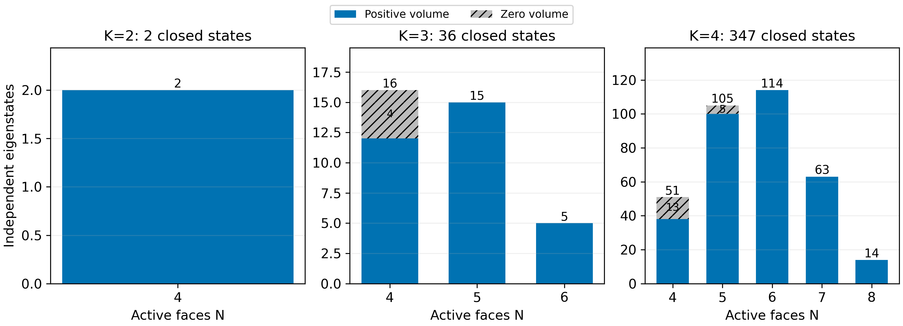
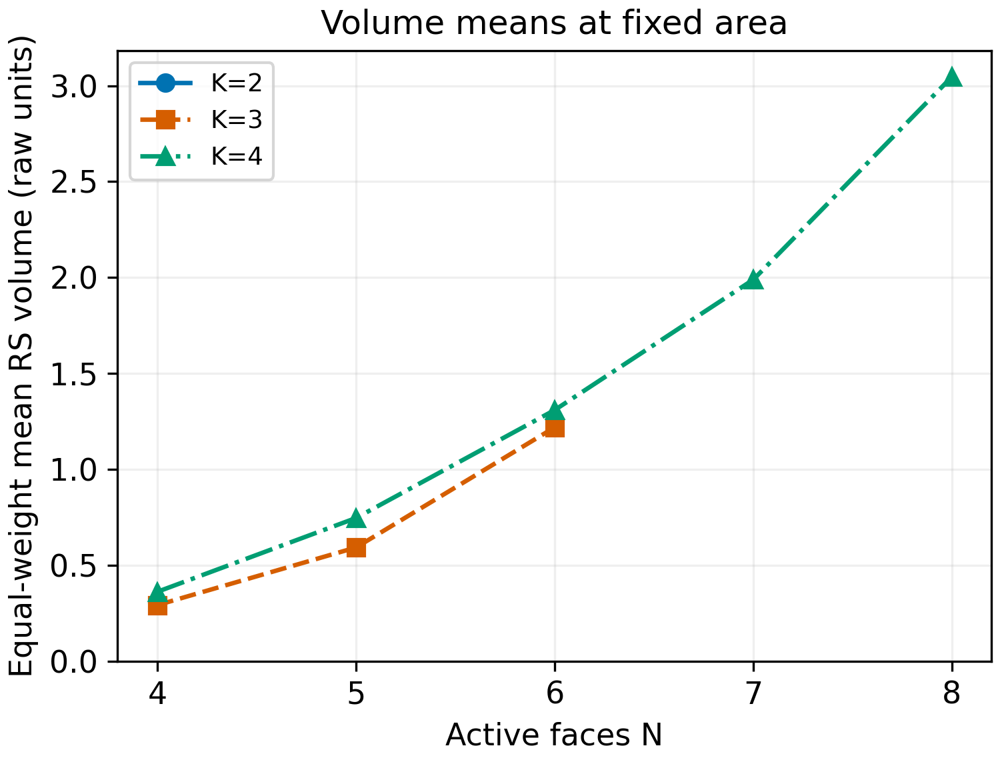

# Volume studies: closed intertwiners and lattice dynamics

*Created: 2026-10-09 11:10:50 IST*
*Last Updated: 2026-10-09 11:10:50 IST*

## Scope and notation

This note records the single-copy volume and lattice-Hamiltonian discussion of October 8–9, 2026. It contains the completed variable-face RS calculation, analytic counting, the bosonic interpretation, the Feller–Livine connection, the proposed research program, and the first Hamiltonian–volume commutator identities. Calculated results, algebra derived in discussion, and proposed investigations are identified separately.

The [thermal-sector note](thermal-area-sectors.md) continues to hold the two-copy squeezed-state construction, occupation coefficients, and reduced-state analysis. Its existing single-copy background remains intact; subsequent volume studies are collected here. The [session summary](../memory-bank/sessions/2026-10-09-lattice-hamiltonian-session-summary.md) and [dialogue transcript](../memory-bank/sessions/2026-10-09-lattice-hamiltonian-transcript.md) preserve the discussion and its chronology. The transcript ends before the last assistant commutator derivation; the summary and this note record that derivation separately from the transcript.

Notation throughout this note:

- $K=\sum_i j_i=\tfrac12\sum_i(n_{a,i}+n_{b,i})$ is the total linear area label.
- $J$ is the resultant angular momentum; closure means $J=0$.
- $N$ counts active, positive-spin faces or occupied sites.
- $L$ counts available lattice sites, including empty ones.
- $\mathbf J_i$ denotes the dimensionless face-flux angular momentum. Physical factors are included in volume prefactors.

The linear area label is distinct from the usual LQG area proportional to $\sum_i\sqrt{j_i(j_i+1)}$. Older thermal sections use $J$ for area and $S$ for resultant spin; translate those labels when comparing the notes.

## Contents

- [Bosons, area, and closure](#bosons-area-and-closure)
- [Triple flux and positive volume](#triple-flux-and-positive-volume)
- [Existing four-face baseline](#existing-four-face-baseline)
- [Complete variable-face results](#complete-variable-face-results)
- [Analytic spin-half and zero-volume controls](#analytic-spin-half-and-zero-volume-controls)
- [Counting states as a function of active face number](#counting-states-as-a-function-of-active-face-number)
- [Single-copy lattice Hamiltonian](#single-copy-lattice-hamiltonian)
- [What Feller and Livine calculated](#what-feller-and-livine-calculated)
- [Hamiltonian–volume commutator](#hamiltonianvolume-commutator)
- [Research program](#research-program)
- [Current continuation and records](#current-continuation-and-records)

## Bosons, area, and closure

At site $i$, introduce two bosonic modes and a two-component operator:
$$
\psi_i=\begin{pmatrix}a_i\\b_i\end{pmatrix},
\qquad [a_i,a_j^\dagger]=[b_i,b_j^\dagger]=\delta_{ij}.
$$
The Schwinger generators and local occupation are
$$
J_i^\alpha=\frac12\psi_i^\dagger\sigma^\alpha\psi_i,
\qquad n_i=a_i^\dagger a_i+b_i^\dagger b_i,
\qquad j_i=\frac{n_i}{2}.
$$
They obey
$$
[J_i^\alpha,J_j^\beta]
=i\delta_{ij}\epsilon_{\alpha\beta\gamma}J_i^\gamma,
\qquad [n_\ell,J_i^\alpha]=0.
$$
Fixed area and closure select the physical states:
$$
\sum_i n_i|\psi\rangle=2K|\psi\rangle,
\qquad \mathbf J_{\mathrm{tot}}|\psi\rangle=0,
\qquad \mathbf J_{\mathrm{tot}}=\sum_i\mathbf J_i.
$$
Equal total $a$ and $b$ occupations impose only $J^z_{\mathrm{tot}}=0$. They do not impose the complete singlet condition. Boundary conditions specify lattice connectivity; closure is the SU(2) restriction on states.

A finite lattice alone has an infinite bosonic Fock space. Fixing total occupation $2K$ at finite $L$ makes the state space finite. In a hopping model, $L$ stays fixed while the number $N$ of occupied sites can change. An orthonormal basis is a finite catalogue; arbitrary pure states are continuous superpositions of its vectors.

### The spin-half restriction

If a site contains exactly one boson, its state can be written
$$
|\chi_i\rangle=\alpha_i a_i^\dagger|0\rangle+\beta_i b_i^\dagger|0\rangle,
\qquad |\alpha_i|^2+|\beta_i|^2=1.
$$
The pair $(\alpha_i,\beta_i)$ is an SU(2) spinor, and $j_i=1/2$. The entries are amplitudes, not occupation numbers. A normalized spinor specifies a direction; exact spin-half support additionally requires single occupation.

With one boson at every available site, $K=L/2$. Ordinary hopping can create a hole and a doubly occupied site, so it does not stay within that restriction. Dynamics confined to it require a spin Hamiltonian or a derived effective interaction from virtual hopping. A product of normalized site spinors is not automatically a global singlet.

## Triple flux and positive volume

For three distinct faces,
$$
q_{ijk}=\mathbf J_i\cdot(\mathbf J_j\times\mathbf J_k)
=\epsilon_{\alpha\beta\gamma}J_i^\alpha J_j^\beta J_k^\gamma
=i[\mathbf J_i\cdot\mathbf J_j,\mathbf J_j\cdot\mathbf J_k].
$$
In lattice bosons,
$$
q_{ijk}=\frac18\epsilon_{\alpha\beta\gamma}
(\psi_i^\dagger\sigma^\alpha\psi_i)
(\psi_j^\dagger\sigma^\beta\psi_j)
(\psi_k^\dagger\sigma^\gamma\psi_k).
$$
This contains three creation and three annihilation operators. It couples collective spins at three sites, rather than requiring exactly one boson at each site. Volume is an observable; including it in a Hamiltonian is a separate choice.

The implemented prescriptions, for unordered triples, are
$$
V_{\mathrm{RS}}=c_{\mathrm{RS}}\sum_{i<j<k}\sqrt{|q_{ijk}|},
\qquad
V_{\mathrm{AL}}=c_{\mathrm{AL}}\sqrt{\left|\sum_{i<j<k}\epsilon_{ijk}q_{ijk}\right|}.
$$
Here $|q|=\sqrt{q^2}$ is defined spectrally, and $\epsilon_{ijk}$ specifies AL tangent-orientation signs. The signs and overall physical normalization must be declared for any geometric comparison. The [operator record](../memory-bank/implementation-details/volume-operator.md) and [numerical preliminaries](../memory-bank/implementation-details/volume-numerical-preliminaries.md) give the implementation conventions.

A zero signed expectation $\langle q\rangle$ does not imply zero positive volume: $\langle\sqrt{|q|}\rangle$ is not $\sqrt{|\langle q\rangle|}$. Likewise, counting basis vectors with positive volume expectation differs from counting positive-volume eigenstates.

### Connected triples in the physical lattice proposal

The user's prescription for the lattice discussion is that connected triples contribute to geometric volume, while unconnected triples remain tracked as possible channels between states with different lattice orderings. Write its selected-triple observable as
$$
V_{\mathrm{conn}}=C\sum_{(i,j,k)\in\mathcal T_G}\sqrt{|q_{ijk}|},
$$
where $\mathcal T_G$ denotes the connected triples in the current ordering.

The precise connected-triple rule, transition mechanism, and geometric normalization were not yet derived. The discussion distinguished mutually adjacent triangles from connected three-site paths, but did not select triangle-only connectivity. The user requested a return to the Hamiltonian–volume commutator before developing reordering details. The assistant's graph-labelled direct-sum formulation was a proposal and was not adopted as a completed model.

The numerical catalogue below uses the stated all-triples RS prescription. It has not evaluated the connected-triple lattice proposal.

## Existing four-face baseline

Earlier work calculated the complete four-labelled-face closed basis for $K=2,\ldots,12$, with zero-spin faces allowed: 10,549 basis states. Saved data include RS/AL spectra, basis expectations and fluctuations, and compressed operators. The extension stopped at the user's request during $K=13$ verification; no $K=13$ result is accepted.

See the [four-face data and storage contract](../results/closed-basis-volume/README.md), [prior session summary](../memory-bank/sessions/2026-10-08-volume-studies.md), and the [existing zero-temperature volume background](thermal-area-sectors.md#section-03). The earlier FL area/shape sweeps remain separate from the complete fixed-spin catalogue.

## Complete variable-face results

The calculation in this session covers $K=2,3,4$, every active face number $4\le N\le2K$, every labelled positive half-integer spin assignment summing to $K$, and every singlet coupling path. It uses
$$
V_{\mathrm{RS}}=(\gamma\hbar)^{3/2}\sum_{i<j<k}\sqrt{|q_{ijk}|},
\qquad \gamma=0.2375,\quad\hbar=1.
$$
No sampling or occupation cutoff is used. Enumeration is exact integer arithmetic; eigenvalues and operator matrices use floating-point arithmetic with independent checks. Absolute physical normalization and higher-valence geometric conversion remain open. AL was not evaluated in this variable-face calculation because higher-valence orientation data were not selected.

### Dimensions and volume kernels

| $K$ | Active faces $N$ | Closed dimension | Zero-volume dimension | Positive-volume dimension |
|---:|---:|---:|---:|---:|
| 2 | 4 | 2 | 0 | 2 |
| 3 | 4 | 16 | 4 | 12 |
| 3 | 5 | 15 | 0 | 15 |
| 3 | 6 | 5 | 0 | 5 |
| 4 | 4 | 51 | 13 | 38 |
| 4 | 5 | 105 | 5 | 100 |
| 4 | 6 | 114 | 0 | 114 |
| 4 | 7 | 63 | 0 | 63 |
| 4 | 8 | 14 | 0 | 14 |

The pooled closed dimensions at $K=2,3,4$ are 2, 36, and 347. The corresponding positive-volume dimensions are 2, 32, and 329; zero-volume dimensions are 0, 4, and 18. Equal-weight mean RS volumes are approximately 0.304653190236, 0.545861741163, and 1.192842810691 in the stated units.

The positive-volume count peaks at $N=4,5,6$ in these three cases. There is a maximum on each finite allowed set of $N$; these examples do not prove a general $N=K+2$ law or uniqueness of the maximum. The phrase “finite-volume states” in the discussion meant nonzero-volume states; all eigenvalues of these finite matrices are finite.

### Figures

[Vector PDF](../figures/variable-n-volume/closed_state_counts.pdf).

[Vector PDF](../figures/variable-n-volume/rs_volume_distributions.pdf).

[Vector PDF](../figures/variable-n-volume/rs_volume_means.pdf). These are kinematic equal-weight means, not thermal averages of a specified Hamiltonian.

### Verification and reusable data

- Counts agree between Clebsch–Gordan coupling paths, independent magnetic $M=0$ minus $M=1$ multiplicities, and inclusion–exclusion.
- Triple operators agree with independent epsilon contractions and dense tensor elements. Checks also cover closure, Casimirs, orthogonality, invariant-subspace projection, Hermiticity, spectral roots, permutation spectra, and previous four-face results.
- The largest recorded construction residual is $2.842170943040401\times10^{-14}$, against an absolute comparison tolerance of $2\times10^{-10}$.
- Independent reconstruction checked 112 saved blocks and 385 eigenstates; its maximum residual is $3.553321148488682\times10^{-15}$.
- The largest singlet block is $14\times14$; the largest magnetic $M=0$ space has dimension 70. The nine compressed operator archives total 770,604 bytes.
- Numerical triple eigenvalues use the cutoff $64\epsilon_{\mathrm{mach}}\max(1,\rho(|q|))$; spectral grouping uses absolute tolerance $2\times10^{-10}$.

Sources and records: [calculator](../code/python/variable_n_volume.py), [verifier](../code/python/verify_variable_n_volume.py), [plotter](../code/python/plot_variable_n_volume.py), [data summary](../results/variable-n-volume/summary.json), [verification](../results/variable-n-volume/verification.json), [spectrum catalogue](../results/variable-n-volume/spectra.csv), and [archive/readme](../results/variable-n-volume/README.md). These are saved results from this session; the documentation update does not rerun the calculation.

## Analytic spin-half and zero-volume controls

For three spin-half factors, $q$ has eigenvalues $0$ with multiplicity 4 and $\pm\sqrt3/4$ with multiplicity 2 each. Exactly,
$$
q^2=\frac3{16}P_{J_{\mathrm{triple}}=1/2},
\qquad
\sqrt{|q|}=\sqrt{\frac{\sqrt3}{4}}\,P_{J_{\mathrm{triple}}=1/2},
$$
with
$$
P_{J_{\mathrm{triple}}=1/2}
=\frac12-\frac23\sum_{\mathrm{pairs\ in\ triple}}\mathbf J_i\cdot\mathbf J_j.
$$
On an $N$-spin-half total singlet,
$$
\sum_{i<j}\mathbf J_i\cdot\mathbf J_j=-\frac{3N}{8}.
$$
Each pair occurs in $N-2$ unordered triples. Therefore the all-triples RS operator is
$$
\boxed{
V_{\mathrm{RS}}=(\gamma\hbar)^{3/2}\sqrt{\frac{\sqrt3}{4}}
\frac{N(N^2-4)}{12}\,I.
}
$$
This explains the constant volume throughout the $N=2K$ singlet sectors in the catalogue. It is an identity for the all-triples prescription; it does not establish scalar volume for an arbitrary connected-triple selection.

Saturated largest-spin assignments, $j_{\max}=\sum_{i\ne\max}j_i$, provide one-dimensional zero-volume controls. They do not exhaust every kernel: the four-spin-1 singlet space at $K=4,N=4$ has an additional zero-volume eigenstate. The exact symbolic and saved-matrix checks are in the [verification record](../results/variable-n-volume/verification.json).

## Counting states as a function of active face number

For $K>0$, the closed dimension on $N$ labelled sites allowing zero spin is
$$
d_N(K)=\frac1{K+1}\binom{K+N-1}{K}\binom{K+N-2}{K},
\qquad d_0(K)=d_1(K)=0.
$$
The [Freidel–Livine framework](https://arxiv.org/abs/1005.2090) provides the fixed-area intertwiner space. Removing empty faces gives the positive-face count
$$
D_K(N)=\sum_{r=0}^{N}(-1)^r\binom Nr d_{N-r}(K).
$$
Neither count removes the volume kernel. For positive volume,
$$
D_K^{V>0}(N)=D_K(N)-\dim\ker V\big|_{K,N}.
$$
The kernel must be determined for the chosen volume prescription.

The relation to [Barbero–Villaseñor's degeneracy-spectrum analysis](https://arxiv.org/abs/1101.3662), [detailed black-hole counting](https://arxiv.org/abs/1101.3660), and [Livine–Terno's polymer models](https://arxiv.org/abs/1205.5733) was discussed. Their conventions and ensembles differ from the present positive-volume problem. In particular, the Barbero–Villaseñor occupation-weighted spin sum is twice our $K$, and its peak counter is $6K+2N$ in our notation; those peaks do not directly count nonzero-volume eigenstates.

An active-face generating-function analysis derived in the discussion gives central large-$K$ estimates
$$
\langle N\rangle=\frac{1+\sqrt2}{2}K+O(1),
\qquad
\operatorname{Var}(N)=\frac{2+\sqrt2}{8}K+O(1).
$$
The corresponding central Gaussian approximation has width of order $\sqrt K$. Exact combinatorial evaluations through $K=100$ were used as checks in chat. These estimates describe equal-weight closed-state counting, not positive-volume counting or a Hamiltonian Gibbs ensemble. At $K=3$, all-closed counts peak at $N=4$, whereas positive-volume counts peak at $N=5$.

On a fixed lattice with $L$ available labelled sites, there are $\binom LN$ choices of occupied positions. Consequently, the infinite-temperature distribution on the complete fixed-$K$ singlet space is
$$
P_{\infty}(N\mid K,L)=\frac{\binom LN D_K(N)}{d_L(K)}.
$$
Here the sum includes the allowed two- and three-face degenerate sectors as well as $N\ge4$; the positive-face catalogue above intentionally starts at four faces. This formula follows from decomposing the complete lattice Hilbert space by occupied positions.

## Single-copy lattice Hamiltonian

The starting model discussed was
$$
H=H_t+H_U+H_g,
$$
$$
H_t=-t\sum_{\langle i,j\rangle}(E_{ij}+E_{ji}),\qquad
E_{ij}=a_i^\dagger a_j+b_i^\dagger b_j,
$$
$$
H_U=\frac U2\sum_i n_i(n_i-1),\qquad
H_g=g\sum_{\langle i,j\rangle}\mathbf J_i\cdot\mathbf J_j.
$$
The basic Bose–Hubbard case sets $g=0$. Equal hopping for both components and these SU(2)-invariant interactions satisfy
$$
[H,K]=0,\qquad [H,J_{\mathrm{tot}}^\alpha]=0.
$$
The Hamiltonian preserves the chosen fixed-area singlet space but does not itself select its area or closure value. No area penalty is necessary when the state space is restricted exactly. Local repulsion discourages concentration; hopping redistributes occupation and can change active-site number. Spin exchange preserves each site's occupation while acting on its spin correlations.

Local site energies, an occupied-site bias, a volume energy term, and singlet pair creation/annihilation were discussed as possible additions, not selected as a complete model. Singlet pair creation changes $K$ while preserving closure. No Hamiltonian simulation has been implemented for this program.

## What Feller and Livine calculated

The relevant paper is Alexandre Feller and Etera R. Livine, [*Quantum Surface and Intertwiner Dynamics in Loop Quantum Gravity*](https://arxiv.org/abs/1703.01156), Phys. Rev. D 95, 124038 (2017). Its principal calculations are classical spinor dynamics:

- Equations (39)–(49): area-preserving hopping, U(N) evolution, periodic-chain Bloch waves, localized perturbations, and finite-size recurrences.
- Equations (50)–(53): local repulsion, lattice Gross–Pitaevskii equations, and interaction-shifted Bloch frequencies.
- Appendix B: linearized Bloch-wave stability and Bogoliubov frequencies.
- Equation (57): a combined hopping, repulsion, and normal-vector/Heisenberg interaction ansatz.
- Section II: separate global closure-defect relaxation and precession models.

The paper deferred full quantum dynamics and detailed analysis of the combined phase diagram. Its explicit fixed-spinor-direction Bloch solution has aligned normals and nonzero closure defect, rather than representing a closed quantum singlet. Its isolated dynamics preserves a specified closure defect. Reference [42] listed a further horizon study as “in preparation (2017)”; this discussion did not establish its later publication status. The Hamiltonian family is therefore attributed to this work; the present quantum volume program remains a proposed investigation. [Full paper](https://arxiv.org/pdf/1703.01156).

## Hamiltonian–volume commutator

The following identities were derived in the last assistant reply of the session, after the transcript cutoff. They were not numerically implemented or independently checked in that turn. The calculation starts with $H_t+H_U$ and a prescribed triple set:
$$
V=C\sum_\tau\sqrt{|q_\tau|}.
$$

### The onsite interaction drops out

Since each $n_\ell$ commutes with every flux and hence every triple operator and its spectral functions,
$$
[n_\ell,q_{ijk}]=[n_\ell,V]=0,
\qquad \boxed{[H_U,V]=0}.
$$
Thus
$$
\boxed{
[H_t+H_U,V]=-tC\sum_{\langle\ell,m\rangle}\sum_\tau
[E_{\ell m}+E_{m\ell},\sqrt{|q_\tau|}].
}
$$
The optional spin-exchange contribution $[H_g,V]$ has not been worked out.

### Hopping against one triple

Define
$$
T_{\ell m}^\alpha=\frac12\psi_\ell^\dagger\sigma^\alpha\psi_m.
$$
The elementary bilinear commutator gives
$$
\boxed{[E_{\ell m},J_i^\alpha]
=(\delta_{mi}-\delta_{\ell i})T_{\ell m}^\alpha.}
$$
For distinct $i,j,k$, the product rule then yields
$$
\begin{aligned}
[E_{\ell m},q_{ijk}]
=\epsilon_{\alpha\beta\gamma}\big[&
(\delta_{mi}-\delta_{\ell i})T_{\ell m}^\alpha J_j^\beta J_k^\gamma\\
+&(\delta_{mj}-\delta_{\ell j})J_i^\alpha T_{\ell m}^\beta J_k^\gamma\\
+&(\delta_{mk}-\delta_{\ell k})J_i^\alpha J_j^\beta T_{\ell m}^\gamma\big].
\end{aligned}
$$
A hopping bond contributes only when one of its endpoints touches the triple. The displayed operator ordering must be retained when both endpoints overlap it.

### Passing to positive volume

A scalar chain rule cannot replace operator functional calculus. For an eigenbasis of one triple operator,
$$
q_\tau|r\rangle=\lambda_r|r\rangle,
$$
the exact spectral identity is
$$
\boxed{
\langle r|[E_{\ell m},\sqrt{|q_\tau|}]|s\rangle
=(\sqrt{|\lambda_s|}-\sqrt{|\lambda_r|})
\langle r|E_{\ell m}|s\rangle.
}
$$
Only matrix elements between different absolute triple-flux eigenvalues contribute to this positive-root commutator. In particular, a nonzero commutator with signed $q_\tau$ does not by itself establish a nonzero commutator with $\sqrt{|q_\tau|}$. Different triples need not have a common spectral basis.

The full summed $[H,V]$ has not been evaluated. Whether contributions cancel on the chosen singlet support and physical triple set is the immediate continuation.

## Research program

The program charted in discussion is proposed work, not a record of completed Hamiltonian calculations:

1. Specify the available sites, graph, Hamiltonian, volume prescription, and exact fixed-$K$ singlet space. Treat strict spin-half occupancy separately.
2. Establish no-hopping, free-hopping, strong-repulsion, and small-sector analytic controls.
3. Construct Hamiltonian and geometric operators together; check their commutators, constraints, volume kernels, and numerical consistency.
4. Calculate singlet-sector ground states, gaps, degeneracies, correlations, entanglement, and volume-measurement distributions.
5. Compare energy preferences in active-site number with the kinematic state-counting peak, including empty-site position multiplicities.
6. Define a genuine closed Gibbs state, calculate volume versus $K$ and temperature, and recover exact counting at infinite temperature.
7. Evolve closed initial states, study quenches and perturbations, and quantify area transport, volume changes, entanglement, and recurrences.
8. Separate large-$K$ fixed-$L$ semiclassical comparisons from large-$K,L$ fixed-filling collective behaviour. Check increasing sizes before interpreting crossovers as phase transitions.
9. Extend to fluctuating area or available-site/graph ensembles with explicit weights and convergence conditions.
10. Construct an energy-basis TFD and compare its reduced state and geometric correlations with the selected squeezed FL family. Geometric gluing remains a further question.

The proposed first Hamiltonian pilot uses four available sites at $K=2,3,4$, initially $g=0$, comparing a complete graph and a periodic ring. Including empty sites, the closed dimensions are 20, 50, and 105. That pilot has not been run.

For a chosen closed fixed-area space,
$$
\rho_{\beta,K,L}=Z^{-1}e^{-\beta H},
\qquad Z=\operatorname{Tr}_{\mathcal H_{K,L}^{\mathrm{closed}}}e^{-\beta H}.
$$
The proposed observables include $\langle V\rangle$, volume variance, $P(V=0)$, $P(N)$, conditional volume at $N$, energy, entropy, and heat capacity. These need not coincide with the equal-weight means plotted above.

A canonical two-copy purification would be
$$
|\mathrm{TFD}_\beta\rangle=Z^{-1/2}\sum_m e^{-\beta E_m/2}
|E_m\rangle_L\otimes|\overline{E_m}\rangle_R.
$$
This is a comparison construction, not a replacement for the selected squeezed FL state. Whether one temperature-independent Hamiltonian reproduces that family remains open in the [thermal note](thermal-area-sectors.md). A purification alone does not establish face matching or geometric gluing.

## Current continuation and records

Resume with the single-copy Hamiltonian–volume commutator, step by step, before developing lattice-ordering transitions. The elementary hopping identities and operator spectral functions are the starting point. No complete commutator matrix, cancellation theorem, graph-changing amplitude, energy spectrum, thermal curve, or phase diagram has been calculated in this session.

The variable-face numerical files and readable catalogue are saved and independently checked for the declared $K=2,3,4$ range; T10 is complete for this scope. Physical prefactors, higher-valence AL orientations, and broader area coverage remain open. The latest documentation closeout corrected README code formatting and did not rerun the physics calculations.

Research ownership and evidence:

- [T10](../memory-bank/tasks/T10.md): variable-face closed-state catalogue and volume kernels.
- [T1a](../memory-bank/tasks/T1a.md): positive-volume reference implementation and four-face baseline.
- [T9](../memory-bank/tasks/T9.md): the selected thermal/two-copy construction and its future geometric comparison.
- [Full session summary](../memory-bank/sessions/2026-10-09-lattice-hamiltonian-session-summary.md) and [transcript](../memory-bank/sessions/2026-10-09-lattice-hamiltonian-transcript.md): chronology, user steering, and distinction between proposals and results.
